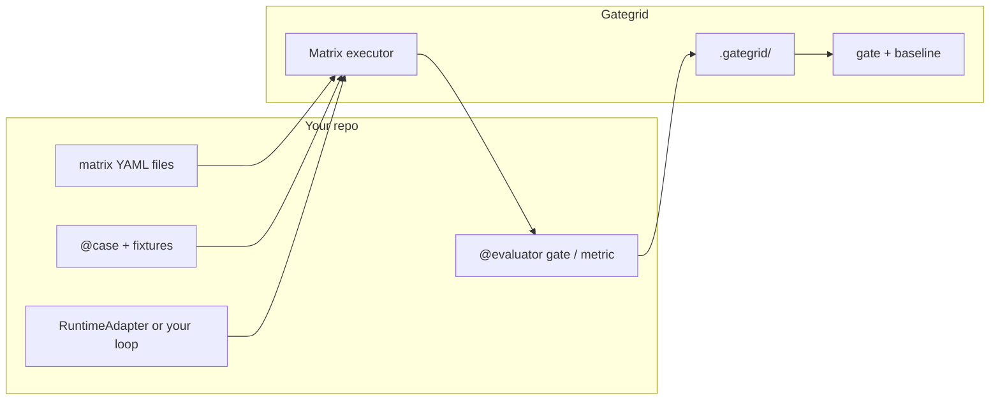

# Gategrid

**Matrix evaluation for LLM agents — pytest for your cases, codecov for your regressions.**

`pip install gategrid` · Python ≥3.11 · [Architecture](docs/roadmap/architecture-vision.md)

**More:** [Extended product brief](docs/roadmap/README-pitch-draft.md) · [Battlecard](docs/roadmap/battlecard.md) · [Competitive landscape](docs/roadmap/competitive-landscape.md) · [v1 checklist](docs/roadmap/v1-implementation-checklist.md)

---

## The problem

Building an agent is only half the work. You still need to know whether a new prompt, tool surface, model, or MCP server build **actually helps** — and whether yesterday’s change **broke** last week’s behavior on **your** stack.

Most teams end up with:

- One-off scripts that don’t compose
- Benchmarks tied to a single agent framework
- CI that runs evals but **doesn’t gate** regressions
- Baselines that mix unrelated profiles or PR envs, so “pass rate vs main” lies

**Gategrid** is the shared runner: you bring cases, runtime, and scorers; it runs the grid, stores results under `.gategrid/`, and fails CI when **your** gated profile regresses.

---

## What it is (and isn’t)

| It is | It isn’t |
| ----- | -------- |
| A **matrix runner** (`cases × profiles × models`) | An agent framework |
| **pytest-shaped** plugins (your code, our infra) | A hosted eval SaaS |
| **Single-profile CI gates** + one baseline file per lane | A mandatory multi-profile fleet baseline |
| **CI-first** (`run`, `gate`, `baseline update` on `main` only) | Direct MCP protocol tests without an LLM |
| **Git-native golden runs** (codecov-style) | promptfoo / LangSmith-style cloud baselines only |

Think **pytest** plus **codecov-style** compare to a stored golden run — for one stack at a time in CI, with optional **benchmark** matrices when you want to compare many profiles on the same cases.

---

## Gate vs benchmark (two jobs)

| | **Gate (CI default)** | **Benchmark (optional)** |
| - | --------------------- | ------------------------ |
| **Question** | Did **our** stack regress? | Which stack is best? |
| **Profiles per run** | **One** per gate matrix | Many (A/B tool surfaces) |
| **Baseline** | `.gategrid/baselines/<profile>.json` | Report only; no PR gate |
| **`baseline update`** | **`main` / nightly** only, full case grid | Not used for gating |

PR and `main` use the **same profile** and the **same baseline file**. Overall and like-for-like comparisons stay honest. Full gate YAML, sampling, and CI flows: [README-pitch-draft.md](docs/roadmap/README-pitch-draft.md).

---

## You write · we run



| You own | Framework owns |
| ------- | ---------------- |
| Cases, runtime, evaluators | Grid expansion, retries, sampling, traces |
| **Several matrix files** per repo (`smoke`, `mcp-gate`, `benchmark`, …) | Reports, **one baseline file per gate lane** |
| **One profile** in each gate matrix | `gategrid gate`, `baseline update` rules |

**Secrets:** values in process env only; YAML names `api_key_env` / `env_pass_through`, never secret values.

---

## Why teams use it

- **One profile per gate** — PR and `main` compare against the same `baselines/<profile>.json`, not a mixed fleet baseline.
- **CI that means something** — PR: `run` → `gate` (never `baseline update` on PR). `main`: `run` → `gate` → `baseline update`.
- **Three layers of pass** — cell (`gate` evaluators), regression (vs baseline), optional hard limits on this run.
- **Cost control** — optional PR sampling shrinks how many cases run without changing the gated profile.
- **Bring your stack** — `RuntimeAdapter`, optional `gategrid[pydantic-ai]`, optional `gategrid[mcp]`, optional [contrib](src/gategrid/contrib/README.md) helpers (file-edit sandbox, MCP profile config, LLM-judge base class).

---

## Try it in 60 seconds (no API key)

```bash
git clone https://github.com/leshchenko1979/gategrid.git
cd gategrid
uv sync --extra dev
gategrid validate --matrix examples/gategrid/matrices/smoke.yaml
gategrid run --matrix examples/gategrid/matrices/smoke.yaml
```

Artifacts land under `.gategrid/reports/` and `.gategrid/baselines/` (override with `GATEGRID_HOME`).

---

## MCP evaluations

LLM-mediated E2E over **your** MCP server (stdio subprocess or remote HTTP). Gategrid does not run docker, databases, or product side effects — you start the MCP process and own secrets.

| Install | Use when |
| ------- | -------- |
| `pip install "gategrid[pydantic-ai,mcp]"` | Path A: pydantic-ai agent + MCP toolsets (example adapter) |
| `pip install "gategrid[mcp]"` | Path B: your adapter + official MCP SDK (or another client) |

MCP connection settings live in **`profile.data.mcp`** (not a core profile field). Helpers: `gategrid.contrib.mcp.mcp_from_profile`, `resolve_env_pass_through` for `data.env_pass_through` **names** only.

```python
from gategrid import case, evaluator
from gategrid.contrib.mcp import mcp_from_profile

# In your RuntimeAdapter.execute:
# mcp_cfg = mcp_from_profile(ctx.profile)
# Path A: mcp_toolset_from_data(...) + run_agent(toolsets=[...])
# Path B: your MCP client + agent loop → RunArtifact
```

```bash
uv sync --extra dev --extra pydantic-ai --extra mcp
export OPENAI_API_KEY=...
gategrid run --matrix examples/gategrid/matrices/mcp-gate.yaml --root examples/gategrid
```

Offline / CI: `matrices/mcp-gate-mock.yaml` with `provider: mock`. See [examples/gategrid/README.md](examples/gategrid/README.md).

---

## Example (Python-first)

```python
from gategrid import case, evaluator

@case(tags=["smoke"], data={"user_prompt": "Create a standup tomorrow 9am"})
def create_event() -> None:
    pass  # prompt in case data; adapter runs the agent loop

@evaluator(role="gate")
def event_created(ctx, artifact):
    return artifact.metrics.get("calendar_write_ok")
```

```bash
gategrid run --matrix examples/gategrid/matrices/smoke.yaml
```

---

## Case study: OpenCrabs hashline

External evaluation of OpenCrabs-style file-editing tools (hashline protocol, fuzzy replace hypotheses, vs a simplified reference stack).

| Artifact | Path |
| -------- | ---- |
| Report | [docs/hashline_hypothesis_report.md](docs/hashline_hypothesis_report.md) |
| Charts | [docs/hashline_hypothesis_report.ipynb](docs/hashline_hypothesis_report.ipynb) |
| In-repo repro | [evals/](evals/) matrices and profiles — see [CLAUDE.md](CLAUDE.md) |

---

## Who it’s for

| Role | Typical use |
| ---- | ----------- |
| **MCP / tool authors** | Gate one candidate profile on shared cases before release |
| **Agent engineers** | Same gate matrix locally and in CI |
| **Platform / QA** | PR `gate` vs `baselines/<profile>.json`; `main` updates baseline |
| **Researchers** | Optional `benchmark` matrix with many profiles — reports only |

---

## How we compare

Gategrid is a **thin git-native regression gate** for one agent stack at a time — not a hosted experiment browser or red-team suite.

| | Gategrid | [promptfoo](https://github.com/promptfoo/promptfoo) | [DeepEval](https://github.com/confident-ai/deepeval) |
| - | -------- | --------------------------------------------------- | ---------------------------------------------------- |
| **CI regression** | One profile, **git** baseline file | Pass-rate / Action compare; cloud share common | Pytest pass; regression UI → Confident AI |
| **Agent runtime** | Pluggable `RuntimeAdapter` | Providers + custom JS | Bring your app |
| **Matrix** | Gate vs benchmark personas | Prompt × provider matrix | Datasets / metrics |

Detail: [docs/roadmap/battlecard.md](docs/roadmap/battlecard.md) · [docs/roadmap/competitive-landscape.md](docs/roadmap/competitive-landscape.md).

---

## Install

```bash
pip install gategrid
pip install "gategrid[pydantic-ai]"        # optional LLM runtime
pip install "gategrid[pydantic-ai,mcp]"   # optional MCP toolsets (pydantic-ai path)
pip install "gategrid[mcp]"               # optional MCP SDK only (bring-your-own adapter)
```

Python ≥3.11. Secrets via environment only.

---

## Contributing and development

Monorepo: [src/gategrid/](src/gategrid/) (framework), [examples/gategrid/](examples/gategrid/) (smoke), [evals/](evals/) (dogfood). Operator setup, tests, and hashline matrices: [CLAUDE.md](CLAUDE.md). Coding principles: [CODE.md](CODE.md).

```bash
uv sync --extra dev
pytest tests/test_gategrid_phase0.py tests/test_gategrid_phase1.py \
  tests/test_gategrid_phase2.py tests/test_gategrid_phase3.py \
  tests/test_gategrid_phase4.py
```

---

## License

See [LICENSE](LICENSE).
