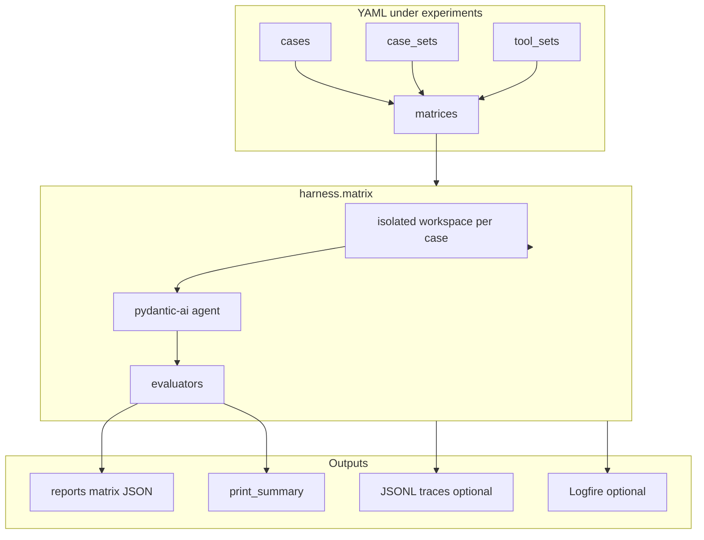

# LLM Agent Eval Harness

**Matrix evaluation for sandboxed LLM agents** — compare tool stacks, system prompts, and models on YAML-defined tasks. Built on [pydantic-ai](https://ai.pydantic.dev/) and [pydantic-evals](https://github.com/pydantic/pydantic-evals).

Each matrix run is `tool_sets × models × cases`, executed in an isolated workspace per case. Swap entire agent configurations without redeploying Python bundles.

## Why this exists

- Agent comparisons do not scale as one-off scripts — you need a **tool × model × task** grid.
- “Looks fine in the demo” does not catch regressions when prompts, tools, or models change.
- Tool surfaces and instructions should be **data** (YAML), not tangled into import-time Python.

## Who it's for


| Audience                  | Typical goal                                                |
| ------------------------- | ----------------------------------------------------------- |
| Tool / protocol designers | Compare full agent stacks (API shape, tool count, behavior) |
| Agent / prompt engineers  | A/B prompts and tool subsets on the same cases              |
| Model / provider teams    | Same stack, different models or endpoints                   |
| Platform / QA             | Pin a matrix + case pack as a regression gate in CI         |
| Researchers               | Tag cases, run hypothesis matrices, extend reporting        |
| Cost / efficiency owners  | Compare turns, tokens, tool failures, and latency           |
| Debuggers                 | Reproduce one matrix cell quickly                           |


## What you can do

**Compare tool surfaces** — define `tool_sets` that list per-tool modules and a `system_prompt`; the matrix runs every combination you declare.

**Compare models** — reference model preset stems from [experiments/models/](experiments/models/) in your matrix `models:` list, or filter to one cell with `--variant <tool-set>/<model-preset>`.

**Compare tasks** — group cases in `case_sets` or list them inline; each case supplies a natural-language `instruction`, sandbox seed content, and expected outcome.

**Smoke one cell** — `harness.evals run --case <name> --tool-set <tool-set> --model <preset>` without running the full grid.

**Gate CI** — run a pinned matrix on `workflow_dispatch` (or re-enable push/PR), upload JSON reports as artifacts, optional Logfire traces.

Commands use placeholders below; bundled names under [experiments/](experiments/) are **examples only**.


| Workflow                   | Command                                                                                   |
| -------------------------- | ----------------------------------------------------------------------------------------- |
| Full matrix (default spec) | `uv run python -m harness.matrix run`                                                     |
| Custom matrix              | `uv run python -m harness.matrix run --matrix path/to/matrix.yaml`                        |
| One variant                | `uv run python -m harness.matrix run --variant <tool-set>/<model-preset>`                 |
| One case                   | `uv run python -m harness.evals run --case <name> --tool-set <tool-set> --model <preset>` |
| Debug trace                | add `--trace`                                                                             |


## How it works




**Matrix axes** (all defined in YAML):


| Axis                        | Where                                           |
| --------------------------- | ----------------------------------------------- |
| Tool surface + instructions | `tool_sets/*.yaml` → `tools:` + `system_prompt` |
| Model                       | `models/*.yaml` + `matrices/*.yaml` → `models:` |
| Tasks                       | `cases/*.yaml` via `cases:` or `case_sets:`     |


**Scoring:** pass/fail is driven by evaluators in [src/harness/evaluators.py](src/harness/evaluators.py). The **example case pack** in this repo uses exact primary-file content match (`FileContentMatch`). Auxiliary evaluators record tool discipline and efficiency; they support comparison but do not override pass/fail today. Forks can plug in different evaluators or case shapes.

**Sandbox:** each case runs in a fresh temp directory. Agents should use workspace-relative paths; [harness.sandbox](src/harness/sandbox.py) normalizes paths inside the workspace (including macOS `/private/var` vs `/var`).

## Observability


| Layer            | Enable          | What you get                                                                                         |
| ---------------- | --------------- | ---------------------------------------------------------------------------------------------------- |
| **Stdout**       | always          | Logs + `print_summary` (pass rate, per-variant averages)                                             |
| **Local JSON**   | always          | `reports/{timestamp}_{commit_sha}_matrix.json` — full matrix [MatrixReport](src/harness/models.py) |
| **JSONL traces** | `--trace`       | `reports/traces/{run_id}.jsonl` — lightweight start/done events                                      |
| **Logfire**      | `LOGFIRE_TOKEN` | pydantic-ai instrumentation; spans `eval/<variant>/<case>`; `send_to_logfire='if-token-present'`     |


**Logfire:** add `LOGFIRE_TOKEN` to `.env` locally or as a GitHub Actions secret. View runs in the [Logfire](https://logfire.pydantic.dev/docs) UI.

**Reports on GitHub:** the example workflow [.github/workflows/evals.yml](.github/workflows/evals.yml) uploads `reports/*.json` as an artifact (`eval-report-<sha>`, 90-day retention, `if: always()`). Download: **Actions** → workflow run → **Artifacts**. JSONL traces are **not** included in that glob. Set repo secrets to match your presets’ `api_key_env` names (the example workflow uses `MINIMAX_API_KEY` and optional `LOGFIRE_TOKEN`). The workflow is `workflow_dispatch` only until push/PR triggers are re-enabled.

Compare runs across commits via artifact JSON; debug a single cell with `harness.evals` and `--trace` without Logfire.

## Quick start

Tutorial names (`my_set`, `my_case`, …) are generic. See [Examples in this repository](#examples-in-this-repository) for bundled sample content.

### 0. Install

Requires [uv](https://docs.astral.sh/uv/) and Python ≥3.11.

```bash
curl -LsSf https://astral.sh/uv/install.sh | sh   # skip if uv is already installed

uv sync --extra dev    # creates/reuses .venv from uv.lock
cp .env.example .env
```

Re-run `uv sync --extra dev` only when `uv.lock` or `pyproject.toml` changes. Do not recreate `.venv` with `python3 -m venv`.

### 1. Add provider API keys

The harness loads `.env` on every run. API keys stay out of YAML — matrices reference model **preset ids**, not secrets.

```bash
# Required: must match api_key_env in your model preset YAML (step 2)
MY_PROVIDER_API_KEY=sk-...

# Optional per-preset overrides (prefix from api_key_env, e.g. MY_PROVIDER_API_KEY → MY_PROVIDER_MODEL):
# MY_PROVIDER_MODEL=my-model-id
# MY_PROVIDER_BASE_URL=https://api.example.com/v1

# Optional — see Observability
LOGFIRE_TOKEN=
```

In CI, define the same names as GitHub Actions **secrets**.

### 2. Configure models

One YAML file per preset under `experiments/models/` (registry key = filename stem):

`experiments/models/my-model.yaml`:

```yaml
provider: openai
model_name: my-model-id
base_url: https://api.example.com/v1
api_key_env: MY_PROVIDER_API_KEY
```


| Field                           | Purpose                                                |
| ------------------------------- | ------------------------------------------------------ |
| Filename stem (`my-model.yaml`) | `models:` in matrix YAML; `--variant .../my-model`     |
| `provider`                      | `openai` (OpenAI-compatible), `anthropic`, or `google` |
| `model_name`                    | Default model string sent to the API                   |
| `base_url`                      | Required for `openai`; optional for others             |
| `api_key_env`                   | Env var from step 1                                    |


Optional runtime overrides per preset: `{PREFIX}_MODEL` and `{PREFIX}_BASE_URL`, where `PREFIX` is derived from `api_key_env` by stripping `_API_KEY` (e.g. `MINIMAX_API_KEY` → `MINIMAX_MODEL`).

For `anthropic` or `google` presets, install optional extras: `uv sync --extra anthropic` or `uv sync --extra all-providers`.

### 3. Compose tools

1. Add `experiments/tooling/<family>/<tool>.py` — one tool function per file, delegating to [harness.tools](src/harness/tools.py) or your own logic with `FileEditDeps`.
2. Do **not** put `SYSTEM_PROMPT`, `TOOLS`, or `register(agent)` in tool modules.
3. Create `experiments/tool_sets/my_set.yaml`:

```yaml
name: my_set
system_prompt: |
  You are an agent working in a sandbox workspace. Use workspace-relative paths only.
tools:
  - tooling/harness/read_file.py
  - tooling/harness/str_replace.py
```

Paths are relative to `experiments/`.

### 4. Add cases

`experiments/cases/my_case.yaml`:

```yaml
name: my_case
instruction: Set the greeting to "Hello, world!" in main.py
file_name: main.py
initial_content: |
  def main():
      print("Hi")
expected_output: |
  def main():
      print("Hello, world!")
tags: []
```

Optional pack: `experiments/case_sets/my_pack.yaml` with `name` and `cases: [my_case]`.

### 5. Define a matrix

Flat YAML under `experiments/matrices/` (no nested `matrix:` block):

`experiments/matrices/my_matrix.yaml`:

```yaml
tool_sets:
  - my_set
models:
  - my-model
case_sets:
  - my_pack
# or: cases: [my_case]
```

Default run target when `--matrix` is omitted: [experiments/matrices/full.yaml](experiments/matrices/full.yaml) (example content in this repo).

### 6. Run

```bash
uv run python -m harness.matrix run --matrix experiments/matrices/my_matrix.yaml
uv run python -m harness.evals run --case my_case --tool-set my_set --model my-model
```

Optional: `--variant my_set/my-model`, `--trace`.

After `source .venv/bin/activate`, you can omit `uv run`. Entry points: `harness-matrix`, `harness-evals`.

## Examples in this repository

The following are **reference implementations**, not requirements for your fork:


| Path                                                                                | Contents                                                                  |
| ----------------------------------------------------------------------------------- | ------------------------------------------------------------------------- |
| [experiments/models/](experiments/models/)                                        | Sample model presets (`minimax-m2.7.yaml`, …)                             |
| [experiments/tool_sets/](experiments/tool_sets/)                                  | Sample stacks (harness-style, OpenCrabs-style ports, hypothesis variants) |
| [experiments/cases/](experiments/cases/) + [experiments/case_sets/](experiments/case_sets/) | Sample workspace tasks (file-outcome scoring)                             |
| [experiments/matrices/](experiments/matrices/)                                    | Sample matrices (`full`, `ci`, `hashline_hypotheses`, …)                  |
| [docs/README.md](docs/README.md)                                                    | Example study write-up and charts                                         |
| [reports/](reports/)                                                              | Example matrix JSON from a past run                                       |


Example preset in `.env.example`: `minimax-m2.7` / `MINIMAX_API_KEY`.

## Layout


| Path                     | Role                                                           |
| ------------------------ | -------------------------------------------------------------- |
| `experiments/cases/`     | One YAML per task                                              |
| `experiments/case_sets/` | Named case lists                                               |
| `experiments/tool_sets/` | `system_prompt` + `tools:`                                     |
| `experiments/tooling/`   | Per-tool `.py` modules                                         |
| `experiments/models/`    | Model preset YAML (`provider`, `model_name`, `api_key_env`, …) |
| `experiments/matrices/`  | Runnable cross-product specs                                   |
| `src/harness/`           | Loader, sandbox, CLI, model factory                            |


Operator details (metrics definitions, example matrix commands): [CLAUDE.md](CLAUDE.md).
