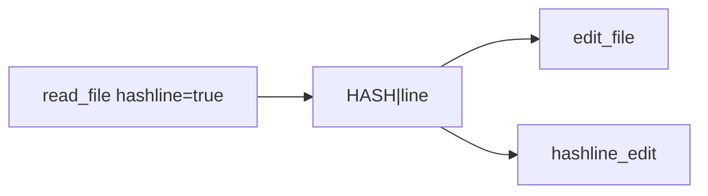
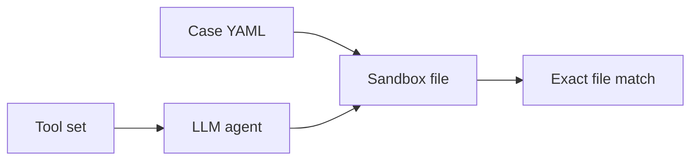
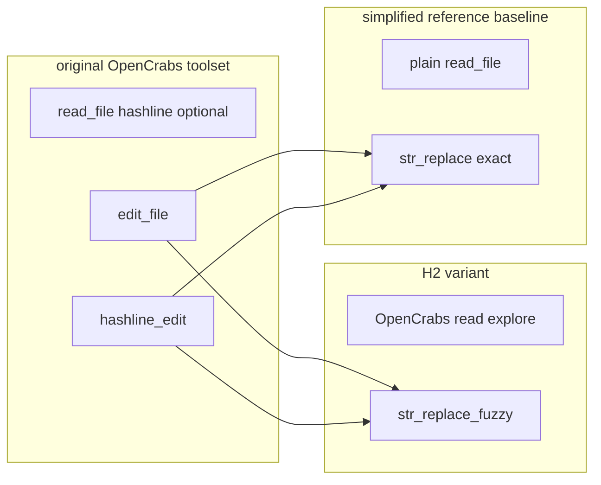
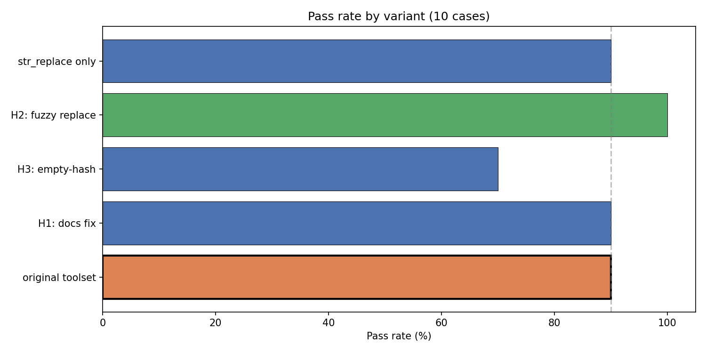
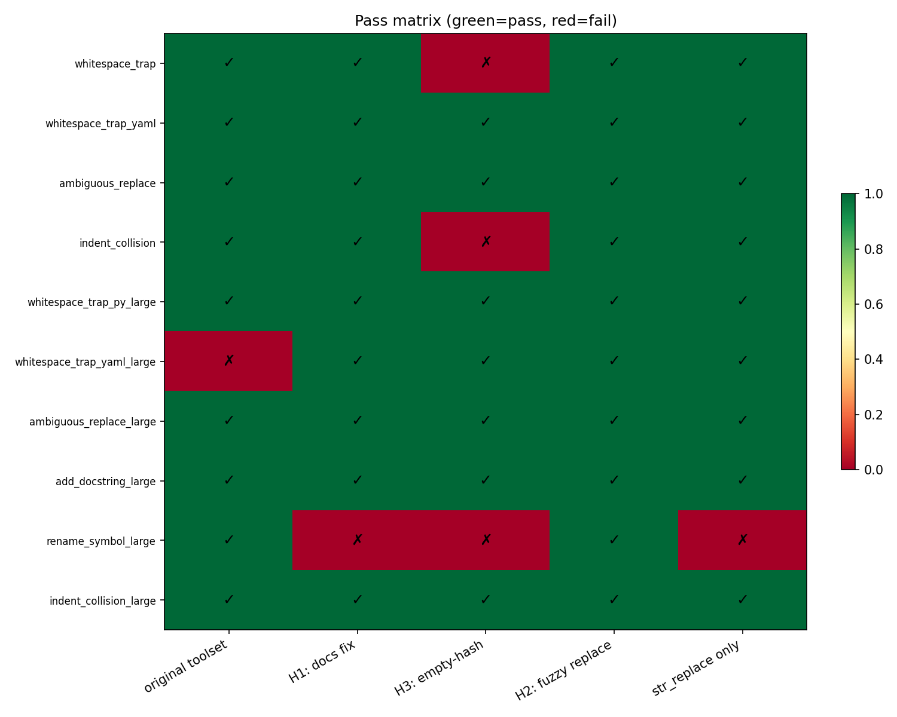
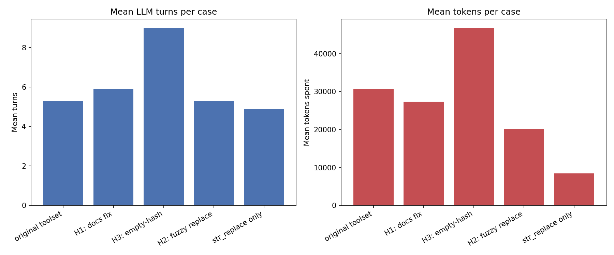
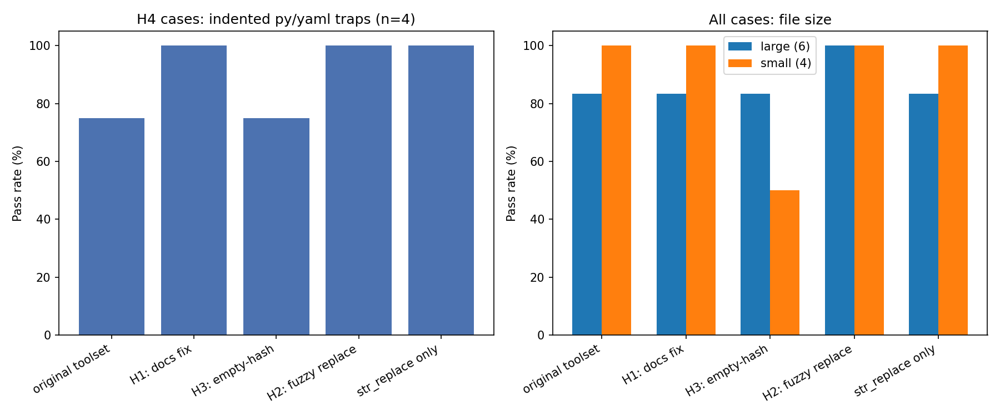

# OpenCrabs file-editing evaluation — hashline and edit-tool design

External evaluation of OpenCrabs-style tooling via a Python port in the `harness_test` repository.

The matrix tests **four design questions**: hashline read/edit protocol (H1–H3), whether **two edit tools** (`edit_file` + `hashline_edit`) should become **one** fuzzy `str_replace` (H2), and how the **original OpenCrabs toolset** compares to a **simplified reference** tool set (H4).

**Artifacts:** this document, [charts](hashline_hypothesis_report.ipynb), [matrix JSON](../reports/2026-05-23T13-22-35.666225+00-00_local-r_matrix.json) (50 runs, `minimax-m2.7`).

**Implementers:** start at [§2 Quick reference](#2-quick-reference-for-implementers). Methodology: [§5](#5-methodology) onward.

---

## 1. Introduction

Researchers integrated OpenCrabs tools into this evaluation codebase to test beliefs about `hashline_edit`, `read_file`, and **tool-surface complexity** (multiple edit APIs vs a single replace). This is a **post-hoc report**, not a merged OpenCrabs PR or a Rust audit.

| Is                                                | Is not                                |
| ------------------------------------------------- | ------------------------------------- |
| Reproducible eval with methodology                | Product sign-off                      |
| Evidence from a Python port                       | Multi-model benchmark                 |
| Input for docs/protocol and tool-design decisions | Proof of byte-identical Rust behavior |

---

## 2. Quick reference for implementers

| If you are…                      | Verdict                                                 | Python port — files to inspect |
| -------------------------------- | ------------------------------------------------------- | ------------------------------ |
| **Fuzzy line replace (H2)**      | **Supported** — see [§8](#8-interpretation)             | [fuzzy_replace.py](../src/harness/fuzzy_replace.py); [str_replace_fuzzy.py](../experiments/tooling/harness/str_replace_fuzzy.py); [opencrabs_h2_fuzzy.yaml](../experiments/tool_sets/opencrabs_h2_fuzzy.yaml) |
| **Hashline docs (H1)**           | Inconclusive — still align docs                         | [opencrabs_h1_docs.yaml](../experiments/tool_sets/opencrabs_h1_docs.yaml); [read_file.py](../experiments/tooling/opencrabs/read_file.py), [hashline_edit.py](../experiments/tooling/opencrabs/hashline_edit.py), [hashline.py](../experiments/tooling/opencrabs/hashline.py) |
| **Collision read format (H3)**   | **Rejected** — do not ship empty-hash display on read   | [opencrabs_h3_collision.yaml](../experiments/tool_sets/opencrabs_h3_collision.yaml); [hashline.py](../experiments/tooling/opencrabs/hashline.py), [H3 read_file](../experiments/tooling/opencrabs_h3/read_file.py) |
| **vs simplified reference (H4)** | Mixed — see [§5 tool surface](#tool-surface-complexity) | [baseline.yaml](../experiments/tool_sets/baseline.yaml) vs [opencrabs_original.yaml](../experiments/tool_sets/opencrabs_original.yaml) |

H2 fuzzy matcher: port of [Codex seek_sequence](https://github.com/openai/codex/blob/main/codex-rs/apply-patch/src/seek_sequence.rs).

[Implementation map](#appendix-implementation-map-python-eval-port) · [Reproduce](#10-limitations-and-reproducibility)

---

## 3. Executive summary

Pass/fail decides hypotheses. The table below summarizes **comparison metrics** for each hypothesis (variant under test vs **original OpenCrabs toolset**, except H4: original vs reference `baseline`). Variant-level detail and charts: [§7](#7-results). Actions: [§9](#9-recommendations-for-upstream).

| ID     | Verdict       | Pass (test vs ref)                | Avg turns      | Avg tokens           | Σ tool_failures | Avg duration       |
| ------ | ------------- | --------------------------------- | -------------- | -------------------- | --------------- | ------------------ |
| **H1** | Inconclusive  | 9/10 vs 9/10                      | 5.9 vs 5.3     | 27,384 vs 30,696     | 2 vs 1          | 17.0s vs 12.6s     |
| **H2** | **Supported** | **10/10** vs 9/10                 | 5.3 vs 5.3     | 20,115 vs 30,696     | 2 vs 1          | 13.5s vs 12.6s     |
| **H3** | **Rejected**  | 7/10 vs 9/10                      | **9.0** vs 5.3 | **46,785** vs 30,696 | **4** vs 1      | **25.3s** vs 12.6s |
| **H4** | Mixed         | 9/10 vs 9/10 (orig vs `baseline`) | 5.3 vs **4.9** | 30,696 vs **8,412**  | 1 vs 3          | 12.6s vs 11.7s     |

**H2** was the only hypothesis variant with a perfect pass rate; it also cut average tokens ~35% vs the original toolset at similar turn count. **H3** failed on pass rate and was worst on turns, tokens, tool failures, and duration—do not ship empty-hash collision display. **H4** tied on pass but the reference bundle has **8 vs 32** total tool parameters and far lower token use ([tool surface §5](#tool-surface-complexity)); that is not a hashline-only comparison.

Details: [§7 Results](#7-results) · [§8 Interpretation](#8-interpretation).

---

## 4. Background: hashline in OpenCrabs

- **`read_file(..., hashline=true)`** — each line is `{2-char-hash}|{line}` (content hash, not line number).
- **`hashline_edit`** — edits anchored by hash; stale hashes rejected.
- **Collisions** — duplicate line content → `COLLISION|{line}` in the original toolset’s read output + warning.
- **H1 motivation** — docs still mention `LINE#ID`-style anchors in places; output is `HASH|content`.

The **original OpenCrabs toolset** ([opencrabs_original.yaml](../experiments/tool_sets/opencrabs_original.yaml)) exposes **two** edit tools: [edit_file](../experiments/tooling/opencrabs/edit_file.py) and [hashline_edit](../experiments/tooling/opencrabs/hashline_edit.py).



---

## 5. Methodology



| Parameter | Value |
| --------- | ----- |
| Suite     | [hashline_hypotheses.yaml](../experiments/suites/hashline_hypotheses.yaml) |
| Runs      | 5 variants × 10 cases = **50**; model `minimax-m2.7` |
| Reference | **original OpenCrabs toolset** (`opencrabs_original`) |

**Pass/fail:** workspace file must match `expected_output` exactly after the agent finishes.

**Metrics:** `passed` decides hypotheses; `turns`, `tokens_spent`, `tool_failures`, and `duration_ms` are for comparison only. An earlier 4-case pilot is superseded; all numbers here are from the final 50-run JSON.

**Caveat:** tools under [experiments/tooling/opencrabs/](../experiments/tooling/opencrabs/) mirror OpenCrabs behavior; re-validate in Rust before production.

### Variant bundles

| Label                          | Eval variant id          | Tool set YAML | Single change vs original toolset |
| ------------------------------ | ------------------------ | ------------- | --------------------------------- |
| **original OpenCrabs toolset** | `opencrabs_original`     | [opencrabs_original.yaml](../experiments/tool_sets/opencrabs_original.yaml) | — (two edit tools: `edit_file` + `hashline_edit`) |
| H1: docs fix                   | `opencrabs_h1_docs`      | [opencrabs_h1_docs.yaml](../experiments/tool_sets/opencrabs_h1_docs.yaml) | Prompt + docstrings only |
| H2: fuzzy replace              | `opencrabs_h2_fuzzy`     | [opencrabs_h2_fuzzy.yaml](../experiments/tool_sets/opencrabs_h2_fuzzy.yaml) | **One** fuzzy `str_replace` instead of two edit tools |
| H3: empty-hash read            | `opencrabs_h3_collision` | [opencrabs_h3_collision.yaml](../experiments/tool_sets/opencrabs_h3_collision.yaml) | H3 [read_file](../experiments/tooling/opencrabs_h3/read_file.py) only |
| **str_replace only**           | `baseline`               | [baseline.yaml](../experiments/tool_sets/baseline.yaml) | H4 reference — see below |

### H4 reference: simplified tool set (`baseline`)

H4 compares the **original OpenCrabs toolset** to the reference tool set in [baseline.yaml](../experiments/tool_sets/baseline.yaml). This is **not** “hashline disabled” in isolation.



### Tool surface complexity

**Counting rule:** per tool, count function parameters **excluding** `ctx: RunContext[...]` (agent-visible schema fields). **Σ params** = sum over all tools in the tool set’s `tools:` list. For `hashline_edit`, each item in `edits` also exposes four schema fields (`op`, `pos`, `end`, `lines`) in addition to top-level `path` + `edits`.

| Tool set           | YAML | Tools | Edit APIs | Σ params |
| ------------------ | ---- | ----- | --------- | -------- |
| Original OpenCrabs | [opencrabs_original.yaml](../experiments/tool_sets/opencrabs_original.yaml) | 6 | 2 | **32** |
| H2 fuzzy           | [opencrabs_h2_fuzzy.yaml](../experiments/tool_sets/opencrabs_h2_fuzzy.yaml) | 5 | 1 | **23** |
| H3 collision       | [opencrabs_h3_collision.yaml](../experiments/tool_sets/opencrabs_h3_collision.yaml) | 6 | 2 | **32** (read impl only) |
| H4 reference       | [baseline.yaml](../experiments/tool_sets/baseline.yaml) | 5 | 1 | **8** |

The reference tool set has **~4×** fewer total parameters than the original bundle (8 vs 32) and one edit API vs two—along with plain read/explore tools, a concrete H4 confound beyond indentation. Charts label this variant **`str_replace only`**; eval YAML id remains `baseline`.

| Tool                  | Params                        | Implementation |
| --------------------- | ----------------------------- | -------------- |
| `read_file`           | 4 (OpenCrabs) / 1 (reference) | [opencrabs/read_file.py](../experiments/tooling/opencrabs/read_file.py) · [harness/read_file.py](../experiments/tooling/harness/read_file.py) |
| `ls`                  | 4 / 1                         | [opencrabs/ls.py](../experiments/tooling/opencrabs/ls.py) · [harness/ls.py](../experiments/tooling/harness/ls.py) |
| `glob`                | 4 / 1                         | [opencrabs/glob.py](../experiments/tooling/opencrabs/glob.py) · [harness/glob_tool.py](../experiments/tooling/harness/glob_tool.py) |
| `grep`                | 8 / 2                         | [opencrabs/grep.py](../experiments/tooling/opencrabs/grep.py) · [harness/grep.py](../experiments/tooling/harness/grep.py) |
| `edit_file`           | 10                            | [edit_file.py](../experiments/tooling/opencrabs/edit_file.py) |
| `hashline_edit`       | 2 (+ 4 per edit item)         | [hashline_edit.py](../experiments/tooling/opencrabs/hashline_edit.py) |
| `str_replace` / fuzzy | 3                             | [str_replace.py](../experiments/tooling/harness/str_replace.py) · [str_replace_fuzzy.py](../experiments/tooling/harness/str_replace_fuzzy.py) |

H3 read override: [opencrabs_h3/read_file.py](../experiments/tooling/opencrabs_h3/read_file.py).

**Confound (H4):** pass-rate and cost differences vs `baseline` may reflect parameter surface, edit-tool count, prompts, or read path—not indentation alone. See [§8](#8-interpretation).

### Test corpus

Suite case list: [hashline_hypotheses.yaml](../experiments/suites/hashline_hypotheses.yaml). Ten cases under [experiments/cases/](../experiments/cases/).

| Case | Task | Size | Hypotheses |
| ---- | ---- | ---- | ---------- |
| [whitespace_trap.yaml](../experiments/cases/whitespace_trap.yaml) | Change greeting to `"Hello, world!"`; keep 4-space indent | small | H1, H4 |
| [whitespace_trap_yaml.yaml](../experiments/cases/whitespace_trap_yaml.yaml) | Change greeting under `data:`; keep 2-space YAML indent | small | H4 |
| [ambiguous_replace.yaml](../experiments/cases/ambiguous_replace.yaml) | Replace only the **first** `value = 1` → `value = 2` | small | H2 |
| [indent_collision.yaml](../experiments/cases/indent_collision.yaml) | Change only the **first** `pass` line to `return 1` (duplicate-hash trap) | small | H1, H3 |
| [whitespace_trap_py_large.yaml](../experiments/cases/whitespace_trap_py_large.yaml) | Same greeting/indent task in a large `main()` file | large | H1, H4 |
| [whitespace_trap_yaml_large.yaml](../experiments/cases/whitespace_trap_yaml_large.yaml) | Same YAML greeting/indent task at scale | large | H4 |
| [ambiguous_replace_large.yaml](../experiments/cases/ambiguous_replace_large.yaml) | First `value = 1` replacement in a large file | large | H2 |
| [add_docstring_large.yaml](../experiments/cases/add_docstring_large.yaml) | Add docstring `'Sums two integers.'` to `calculate_sum` | large | H1, H2 |
| [rename_symbol_large.yaml](../experiments/cases/rename_symbol_large.yaml) | Rename `foo` → `bar`; do not change string literal `'foo'` | large | H2 |
| [indent_collision_large.yaml](../experiments/cases/indent_collision_large.yaml) | First `pass` → `return 1` with duplicate-hash lines at scale | large | H1, H3 |

---

## 6. Hypotheses H1–H4

One isolated change per variant vs the **original OpenCrabs toolset**. Pass criterion and tool bundles: [§5](#5-methodology). Case tasks: [§5 test corpus](#test-corpus).

**H1 — Docs:** Fixing docs to describe `HASH|content` (not `LINE#ID`) improves success. Variant: [opencrabs_h1_docs.yaml](../experiments/tool_sets/opencrabs_h1_docs.yaml). Success: pass rate ↑ vs original on indent/collision-related cases. Cases: [corpus §5](#test-corpus) (trap, collision, docstring large).

**H2 — Fuzzy replace:** **Two edit tools → one** fuzzy line-block `str_replace` improves outcomes. Variant: [opencrabs_h2_fuzzy.yaml](../experiments/tool_sets/opencrabs_h2_fuzzy.yaml). Success: pass rate ≥ original on ambiguous/rename/large cases. Cases: [corpus §5](#test-corpus) (ambiguous*, rename large, docstring large).

**H3 — Collision display:** Showing collisions as empty-hash lines on read beats `COLLISION|{line}` prefix. Variant: [opencrabs_h3_collision.yaml](../experiments/tool_sets/opencrabs_h3_collision.yaml). Success: pass rate ↑ on collision cases. Cases: [indent_collision](../experiments/cases/indent_collision.yaml), [indent_collision_large](../experiments/cases/indent_collision_large.yaml).

**H4 — vs reference:** Original OpenCrabs toolset worse than simplified reference on indented py/yaml. Compare original vs [baseline.yaml](../experiments/tool_sets/baseline.yaml). Success: lower pass for original on [H4 trap cases](#h4-reference-simplified-tool-set-baseline). Cases: [corpus §5](#test-corpus) (whitespace trap*, large py/yaml traps).

---

## 7. Results





**Failures vs original OpenCrabs toolset:** original — [whitespace_trap_yaml_large](../experiments/cases/whitespace_trap_yaml_large.yaml); H3 — [whitespace_trap](../experiments/cases/whitespace_trap.yaml), [indent_collision](../experiments/cases/indent_collision.yaml), [rename_symbol_large](../experiments/cases/rename_symbol_large.yaml); H1 — [rename_symbol_large](../experiments/cases/rename_symbol_large.yaml); str_replace only — [rename_symbol_large](../experiments/cases/rename_symbol_large.yaml).





*Left: pass rate on the four H4 trap cases only. Right: all cases split by `size:large` (6 large, 4 small).*

[Notebook](hashline_hypothesis_report.ipynb)

### Variant metrics (means)

| Variant                    | Pass      | Avg turns | Avg tokens | Σ tool_failures | Avg duration |
| -------------------------- | --------- | --------- | ---------- | --------------- | ------------ |
| original OpenCrabs toolset | 9/10      | 5.3       | 30,696     | 1               | 12.6s        |
| H1: docs fix               | 9/10      | 5.9       | 27,384     | 2               | 16.9s        |
| H2: fuzzy replace          | **10/10** | 5.3       | 20,115     | 2               | 13.5s        |
| H3: empty-hash read        | 7/10      | **9.0**   | **46,785** | **4**           | **25.3s**    |
| str_replace only           | 9/10      | 4.9       | **8,412**  | 3               | 11.7s        |

---

## 8. Interpretation

**H1 — Docs:** Inconclusive. Doc clarity may help large YAML ([whitespace_trap_yaml_large](../experiments/cases/whitespace_trap_yaml_large.yaml)) but did not fix [rename_symbol_large](../experiments/cases/rename_symbol_large.yaml) under H1. See [§9](#9-recommendations-for-upstream).

**H2 — Fuzzy replace:** Supported — only variant with a clean sweep; see [§3](#3-executive-summary) and [§7](#7-results). Starting points: [fuzzy_replace.py](../src/harness/fuzzy_replace.py), [Codex seek_sequence](https://github.com/openai/codex/blob/main/codex-rs/apply-patch/src/seek_sequence.rs).

**H3 — Empty-hash collision display:** Rejected — regressed [whitespace_trap](../experiments/cases/whitespace_trap.yaml) and [indent_collision](../experiments/cases/indent_collision.yaml) (27 turns on the latter). Worst efficiency in [§7](#7-results). Do not default to empty-hash collision display on read.

**H4 — vs simplified reference:** Mixed on pass; reference wins on token cost and has a much smaller tool parameter surface ([§5 tool surface](#tool-surface-complexity)). Weak spots for the original toolset include collisions and large YAML, not uniform loss on indented traps.

---

## 9. Recommendations for upstream

| Priority   | Action |
| ---------- | ------ |
| **High**   | Align docs to `HASH\|content`; deprecate line-number ID wording |
| **High**   | Do not ship empty-hash collision read format without retesting |
| **Medium** | Explore fuzzy line-block replace (H2) as alternative to dual edit tools |
| **Medium** | Keep explicit `COLLISION\|` prefix or block `hashline_edit` on collision lines |
| **Low**    | Replicate in Rust and additional models |

---

## 10. Limitations and reproducibility

**Limitations:** single model; Python port ≠ Rust; eval-authored cases; exact-match pass criterion; no upstream pre-registration.

```bash
pip install -e ".[report]"
# matrix runner CLI (harness_test package)
python -m harness.matrix run --suite experiments/suites/hashline_hypotheses.yaml
python docs/_build_report_viz.py
jupyter nbconvert --execute --to notebook docs/hashline_hypothesis_report.ipynb
```

**Artifacts:** [matrix JSON](../reports/2026-05-23T13-22-35.666225+00-00_local-r_matrix.json) · [notebook](hashline_hypothesis_report.ipynb) · [CLAUDE.md](../CLAUDE.md)

---

## Appendix: Implementation map (Python eval port)

Compact path index; tool-parameter detail: [§5 tool surface](#tool-surface-complexity). Per-hypothesis entry points: [§2](#2-quick-reference-for-implementers).

| Component | Path |
| --------- | ---- |
| Tool sets | [opencrabs_original.yaml](../experiments/tool_sets/opencrabs_original.yaml), [opencrabs_h1_docs.yaml](../experiments/tool_sets/opencrabs_h1_docs.yaml), [opencrabs_h2_fuzzy.yaml](../experiments/tool_sets/opencrabs_h2_fuzzy.yaml), [opencrabs_h3_collision.yaml](../experiments/tool_sets/opencrabs_h3_collision.yaml), [baseline.yaml](../experiments/tool_sets/baseline.yaml) |
| Suite / cases | [hashline_hypotheses.yaml](../experiments/suites/hashline_hypotheses.yaml), [experiments/cases/](../experiments/cases/) |
| Hashline core | [hashline.py](../experiments/tooling/opencrabs/hashline.py) |
| Fuzzy matcher (H2) | [fuzzy_replace.py](../src/harness/fuzzy_replace.py) |

**Rust upstream:** collision/read formatting ≈ `read.rs`; hash alphabet ≈ `hash.rs`. Fuzzy replace was evaluated only in this repo’s Python port.
