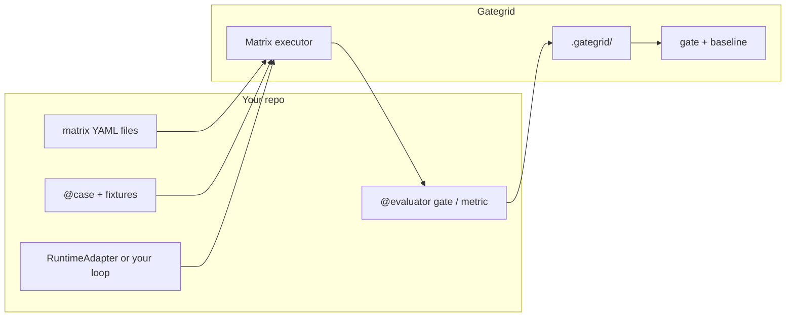

# Gategrid

**Matrix evaluation for LLM agents — pytest for your cases, codecov for your regressions.**

`pip install gategrid` · Python ≥3.11 · [Architecture](architecture-vision.md)

> **Canonical product page:** [README.md](../../README.md) — problem, gate vs benchmark, quick start, case study. **This file** is extended GTM: full gate YAML, sampling, MCP, positioning tables.

**Go-to-market docs:** [Competitive landscape](competitive-landscape.md) · [Battlecard vs promptfoo / DeepEval](battlecard.md) · [v1 build checklist](v1-implementation-checklist.md)

---

## The problem

Building an agent is only half the work. You still need to know whether a new prompt, tool surface, model, or MCP server build **actually helps** — and whether yesterday’s change **broke** last week’s behavior on **your** stack.

Most teams end up with:

- One-off scripts that don’t compose
- Benchmarks tied to a single agent framework
- CI that runs evals but **doesn’t gate** regressions
- Baselines that mix unrelated profiles or PR envs, so “pass rate vs main” lies

**Gategrid** is the shared runner: you bring cases, runtime, and scorers; it runs the grid, stores results under `.gategrid/`, and fails CI when **your** gated profile regresses.

---

## What it is (and isn’t)

| It is | It isn’t |
| ----- | -------- |
| A **matrix runner** (`cases × profiles × models`) | An agent framework |
| **pytest-shaped** plugins (your code, our infra) | A hosted eval SaaS |
| **Single-profile CI gates** + one baseline file per lane | A mandatory multi-profile fleet baseline |
| **CI-first** (`run`, `gate`, `baseline update` on `main` only) | Direct MCP protocol tests without an LLM |
| **Git-native golden runs** (codecov-style) | promptfoo / LangSmith-style cloud baselines only |

Think **pytest** plus **codecov-style** compare to a stored golden run — for one stack at a time in CI, with optional **benchmark** matrices when you want to compare many profiles on the same cases.

---

## Gate vs benchmark (two jobs)

| | **Gate (CI default)** | **Benchmark (optional)** |
| - | --------------------- | ------------------------ |
| **Question** | Did **our** stack regress? | Which stack is best? |
| **Profiles per run** | **One** (`mcp-candidate`) | Many (A/B tool surfaces) |
| **Baseline** | `baselines/mcp-candidate.json` — that profile only | Report only; no PR gate |
| **`baseline update`** | **`main` / nightly** only, full case grid | Not used for gating |

PR and `main` use the **same profile** and the **same baseline file**. Overall and like-for-like comparisons stay honest.

---

## You write · we run



| You own | Framework owns |
| ------- | ---------------- |
| Cases, runtime, evaluators | Grid expansion, retries, sampling, traces |
| **Several matrix files** per repo (`smoke`, `mcp-gate`, `benchmark`, …) | Reports, **one baseline file per gate lane** |
| **One profile** in each gate matrix | `gategrid gate`, `baseline update` rules |

**Secrets:** values in process env only; YAML names `api_key_env` / `env_pass_through`, never secret values.

---

## Why teams use it

### 1. Several matrices, one profile per gate

| Matrix | Use | Profiles |
| ------ | --- | -------- |
| `matrices/mcp-gate.yaml` | PR + `main` baseline | **1** (`mcp-candidate`) |
| `matrices/smoke.yaml` | Fast sanity | 1 reference |
| `matrices/benchmark.yaml` | Optional stack comparison | many — **no PR gate** |

```yaml
# matrices/mcp-gate.yaml — same stack on PR and main
name: mcp-gate
cases:
  - my_agent.cases.calendar:create_event
profiles: [mcp-candidate]
models: [gpt-4o-mini]
gate:
  baseline: mcp-candidate    # → .gategrid/baselines/mcp-candidate.json
```

```yaml
# matrices/benchmark.yaml — research only (example)
profiles: [stack-a, stack-b, stack-c]
# no gate.baseline / no baseline update in CI
```

### 2. CI that means something

**PR:** `run` (optional sample) → `gate` — **never** `baseline update`.

**`main`:** `run` (full grid, same profile) → `gate` → `baseline update` → commit or upload `baselines/mcp-candidate.json`.

Three layers of pass:

1. **Cell** — `gate` evaluators pass (with `run.max_retries` for flake).
2. **Regression** — overall + like-for-like vs **that profile’s** baseline file.
3. **Hard limits** — floors on this run (`pass_rate_min`, token caps) when PR env ≠ `main`.

```yaml
run:
  max_retries: 1
  sample:                    # PR only; omit on main
    max_cells: 30
    share: 0.25
    seed: 0
    always_include_tags: [smoke]
gate:
  baseline: mcp-candidate
  regression:
    bounds:
      overall: { pass_rate_min_delta: -0.02 }
      like_for_like: { pass_rate_min_delta: -0.01 }
  limits:
    overall: { pass_rate_min: 0.80 }
```

```bash
# PR
gategrid run --matrix matrices/mcp-gate.yaml
gategrid gate --baseline .gategrid/baselines/mcp-candidate.json

# main — refresh golden (same matrix, no sample)
gategrid run --matrix matrices/mcp-gate.yaml
gategrid gate
gategrid baseline update --from-report .gategrid/reports/latest.json
```

```text
.gategrid/
  baselines/mcp-candidate.json   # one profile — commit or CI artifact
  reports/                       # gitignore
```

### 3. Cost control: randomized sampling (PR)

Sampling only shrinks **how many cases** run; it does **not** change the profile. Skipped cells are omitted from aggregates, not counted as pass.

- **Like-for-like** = keys in both this report and `baselines/mcp-candidate.json`.
- **`main`** builds the baseline with **no sample** so the golden grid is complete.

### 4. MCP evaluations without re-platforming

LLM-mediated E2E over your MCP server (stdio or remote). You own docker, DBs, and side effects.

### 5. Bring your stack

`RuntimeAdapter`, optional `pip install gategrid[pydantic-ai,mcp]`, optional `contrib` defaults (e.g. LLM-judge base class you subclass).

---

## Example (Python-first)

```python
from gategrid import case, evaluator

@case(tags=["smoke"])
async def create_event(profile, ctx):
    return await run_my_agent(
        mcp=profile.mcp,
        user_turns=["Create a standup tomorrow 9am"],
        model=profile.model,
    )

@evaluator(tags=["gate"])
def event_created(artifact, ctx):
    assert artifact.metrics.get("calendar_write_ok")
```

```bash
export OPENAI_API_KEY=...
gategrid run --matrix matrices/mcp-gate.yaml
gategrid gate
```

---

## Flakes (honest)

v1: **cell retries** (`run.max_retries`) — cell passes if any attempt passes all `gate` evaluators; `flaky_suspect` when attempts disagree.

---

## Who it’s for

| Role | Typical use |
| ---- | ----------- |
| **MCP / tool authors** | Gate one candidate profile on shared cases before release |
| **Agent engineers** | Same gate matrix locally and in CI |
| **Platform / QA** | PR `gate` vs `baselines/<profile>.json`; `main` updates baseline |
| **Researchers** | Optional `benchmark` matrix with many profiles — reports only |

---

## How we compare

| | Gategrid | [promptfoo](https://github.com/promptfoo/promptfoo) | [DeepEval](https://github.com/confident-ai/deepeval) | MCP protocol testers |
| - | -------- | --------------------------------------------------- | ---------------------------------------------------- | -------------------- |
| **CI regression** | One profile, **git** baseline file | Pass-rate / Action compare; cloud share common | Pytest pass; regression UI → Confident AI | No |
| **Agent runtime** | Pluggable `RuntimeAdapter` | Providers + custom JS | Bring your app | N/A |
| **Matrix** | Gate vs benchmark personas | Prompt × provider matrix | Datasets / metrics | Tool-call probes |
| **Red team** | Out of scope v1 | Core strength | Supported | Often core |

Detail: [battlecard.md](battlecard.md) · [competitive-landscape.md](competitive-landscape.md).

---

## Install

```bash
pip install gategrid
pip install gategrid[pydantic-ai,mcp]   # optional
```

Python ≥3.11. Secrets via environment only.

---

## Roadmap

| Still on roadmap | Notes |
| ---------------- | ----- |
| `gategrid init`, HTML report, rate-limit retries | [v1 checklist](v1-implementation-checklist.md) Phase 6 |
| Spikes B / A (ai-antispam, fast-mcp-telegram) | [dogfood-notes](dogfood-notes.md) |

Design: [architecture-vision.md](architecture-vision.md). Operator setup: [CLAUDE.md](../../CLAUDE.md).

---

## License

See [LICENSE](../../LICENSE) in the repository.
