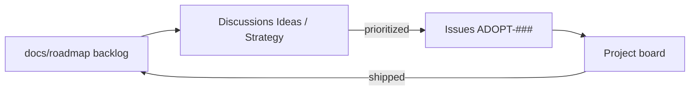

# Adoption & usability backlog

Living backlog of ideas to increase adoption and usability of **Gategrid**.
Captured from brainstorming session (2026-05-23). Use for discussion, expansion, and prioritization before strategy/GTM work.

**Status:** in GitHub Project for prioritization — [Adoption & Usability Roadmap](https://github.com/users/leshchenko1979/projects/5) (issues [#1–#19](https://github.com/leshchenko1979/gategrid/issues?q=label%3Aadoption)).

---

## North star audiences

| Audience | Success looks like |
| -------- | ------------------ |
| Tool / protocol designers | Drop in their tool surface, run against a standard case pack, get a shareable diff report |
| Agent engineers | Scaffold → smoke one cell → full matrix in under 30 minutes |
| Platform / QA | Pin matrix in CI, fail PR on regression, compare runs across commits |
| Cost / efficiency owners | Compare turns, tokens, tool failures, and latency with cost estimates |
| Researchers | Tag cases, run hypothesis matrices, extend reporting |

Pick a **primary audience** for each quarter; secondary audiences benefit from the same ergonomics work but messaging differs.

---

## Tier 1 — Quick wins (high impact, low complexity)

| ID | Idea | Why it matters |
| -- | ---- | -------------- |
| ADOPT-001 | **Unified CLI** — single `agent-eval` entry with subcommands: `init`, `list`, `validate`, `run matrix`, `run case`, `report diff` | Two entry points today (`agent-eval-matrix`, `agent-eval`); only `run` exists. Discovery and validation reduce first-run failures. |
| ADOPT-002 | **`init` scaffold** — generate `experiments/{cases,tool_sets,models,matrices,tooling}/` plus one working mock case/matrix | README quick start is six manual steps; time-to-first-pass should be minutes. |
| ADOPT-003 | **`--experiments` root** — env `AGENT_EVAL_EXPERIMENTS` or CLI flag so config is not tied to repo root | Unblocks library mode, monorepo packs, PyPI install without forking. |
| ADOPT-004 | **Failure UX** — unified diff (expected vs actual), copy-paste rerun command, trace path on fail | **Mostly done (2026-05-25):** `cli_output`, slim artifacts, diff in `artifact.evaluators`; trace replay still **ADOPT-018**. |
| ADOPT-005 | **Tiered CI** — PR: demo (no secrets); manual/nightly: smoke; release/weekly: full matrix + artifact | Public CI badge and artifact history are adoption signals; workflow is `workflow_dispatch` only today. |

---

## Tier 2 — Usability depth (medium effort)

| ID | Idea | Why it matters |
| -- | ---- | -------------- |
| ADOPT-006 | **Parallel execution** — `--concurrency N`, semaphores, timeouts, progress/ETA | Full matrix runs sequentially; daily iteration is slow at scale. |
| ADOPT-007 | **HTML report** — `agent-eval report html report.json`; heatmap, deltas, failed-case diffs, tag breakdown | JSON in Actions artifacts is invisible to most stakeholders; extend `_build_report_viz.py` patterns. |
| ADOPT-008 | **YAML JSON Schema** — published schemas + `$schema` in templates; optional editor snippets | YAML-as-config is the product; schema lowers authoring bar and catches errors early. |
| ADOPT-009 | **Evaluator plug-in registry** — matrix YAML declares evaluators; document fork contract | Pass/fail is `FileContentMatch` only; blocks non-file-editing and custom scoring without core changes. |
| ADOPT-010 | **Demo → smoke wizard** — after `--demo`, guided path to add API key and run smoke (2 cells) | Bridges demo and production; common drop-off point for eval tools. |

---

## Tier 3 — Ecosystem & distribution

| ID | Idea | Why it matters |
| -- | ---- | -------------- |
| ADOPT-011 | **PyPI package** — semver, changelog, optional extras (`anthropic`, `report`, `all`) | Standard adoption path: `pip install` + local config dir. |
| ADOPT-012 | **Standard case packs** — optional installable packs (file-editing, refactoring, community) | Tool designers need shared benchmarks, not bespoke 3-case packs. |
| ADOPT-013 | **Logfire dashboard template** — importable dashboard for pass rate, tokens/case, tool failures | Observability is wired; packaged dashboards reduce setup to zero. |
| ADOPT-014 | **GitHub Action** — marketplace wrapper with matrix input, secrets, artifact + PR comment summary | Platform/QA wants copy-paste CI, not workflow archaeology. |
| ADOPT-015 | **MCP server** — `list_cases`, `run_variant`, `get_failure_diff` for in-IDE iteration | Meta-adoption: harness evaluates agents; MCP makes it native to agent IDE workflows. |

---

## Tier 4 — Differentiation (research → product)

| ID | Idea | Why it matters |
| -- | ---- | -------------- |
| ADOPT-016 | **Baseline pinning & regression gates** — matrix YAML: baseline variant, max pass-rate drop, max token increase | Moves from benchmark to quality gate for platform teams. |
| ADOPT-017 | **Cost estimator** — dry-run token/cost estimate from matrix size + historical heuristics | Surprise API bills kill adoption for cost-conscious teams. |
| ADOPT-018 | **Trace replay** — re-run failed cell from trace (deterministic tool replay ± LLM) | Separates tool bugs from model flake for tool designers. |
| ADOPT-019 | **Multi-outcome evaluators** — `expected_files`, `must_contain`, pytest-style checks | Byte-identical match discourages broader case authoring. |
| ADOPT-020 | **Provider rate-limit retries (429)** — exponential backoff + jitter on LLM HTTP 429/503 in `gategrid.integrations`; config on matrix `run` or model preset; report `rate_limit_retries` per cell; distinct from `run.max_retries` (eval flake) | Bench matrices (e.g. hashline 5×10) hit provider caps; without retries, gate/bench conflate infra failure with agent failure — see [dogfood-notes](dogfood-notes.md), [v1 checklist §6.8](v1-implementation-checklist.md#phase-6--post-v1-defer) |

---

## Strategic approaches (pick emphasis per quarter)

| Approach | Focus | Pros | Cons | Best when |
| -------- | ----- | ---- | ---- | --------- |
| **A. Developer ergonomics** | CLI, init, validate, failure diffs | Fast to ship; helps clone-and-fork users now | Does not expand beyond file-editing evals by itself | Goal is repeat local use and contributors |
| **B. Distribution** | PyPI, `--experiments`, GitHub Action | Teams embed without cloning | Packaging and API stability burden | Goal is embeddability in other products |
| **C. Reporting & CI** | HTML reports, regression gates, tiered CI | Org-wide quality signals | Less help for solo first-run | Platform/QA and tool vendors are buyers |

**Default sequencing recommendation:** A → B → C (prove loop locally, then scale embeddability, then org stickiness).

---

## Suggested implementation phases (draft)

| Phase | Scope | IDs |
| ----- | ----- | --- |
| Phase 1 (weeks 1–2) | Unified CLI, init, failure diffs | ADOPT-001, ADOPT-002, ADOPT-004 |
| Phase 2 (weeks 3–5) | Experiments root, HTML report, tiered CI | ADOPT-003, ADOPT-005, ADOPT-007 |
| Phase 3 (later) | PyPI, concurrency, evaluator plugins, GitHub Action | ADOPT-006, ADOPT-009, ADOPT-011, ADOPT-014 |

Phases are placeholders until prioritization against strategy/GTM.

---

## GitHub tooling for discussion & prioritization

Recommended stack (lightweight → actionable):

### 1. GitHub Discussions — explore and expand

**Use for:** open-ended ideas, GTM/strategy threads, “should we?” questions before work is scoped.

Suggested categories:

| Category | Purpose |
| -------- | ------- |
| **Ideas** | New backlog items; link back to this doc or ADOPT-### id |
| **Strategy & GTM** | Audience, positioning, partnerships, launch plans |
| **Q&A** | User/support questions that may spawn ideas |
| **Show and tell** | Report screenshots, case packs, integrations |

Enable **Upvotes** (reactions) on Ideas posts for rough demand signal. Pin this backlog doc in the Ideas category description.

### 2. GitHub Issues — commit and track work

**Use for:** items ready for design or implementation; one issue per ADOPT-### (or epics with sub-issues).

Suggested labels:

| Label | Meaning |
| ----- | ------- |
| `adoption` | Adoption/usability theme |
| `tier:quick-win` / `tier:medium` / `tier:strategic` | Effort band |
| `area:cli`, `area:reporting`, `area:ci`, `area:distribution`, `area:evaluators` | Subsystem |
| `audience:tool-designer`, `audience:agent-eng`, `audience:platform` | Primary beneficiary |
| `needs-design` / `ready` | Gate before implementation |

Issue body template: problem, proposed solution, success metric, ADOPT id, links to Discussion thread.

### 3. GitHub Projects (v2) — prioritize and roadmap

**Live project:** [Adoption & Usability Roadmap](https://github.com/users/leshchenko1979/projects/5) — linked to this repo; 19 issues (`ADOPT-001`–`ADOPT-019`).

Custom fields on the board:

| Field | Values |
| ----- | ------ |
| **ADOPT ID** | ADOPT-001 … ADOPT-019 |
| **Tier** | Quick win, Medium, Strategic |
| **Phase** | Phase 1, Phase 2, Phase 3, Unassigned |
| **Effort** | S, M, L |
| **Impact** | 1–5 (draft scores) |
| **Priority** | Backlog → Consider → Next → Later → Now |
| **Status** | Todo / In Progress / Done |

**Use for:** drag-and-drop prioritization; filter/sort by Tier, Phase, Impact before strategy/GTM.

### 4. Milestones — time-box themes

Example: `2026-Q3 ergonomics`, `2026-Q4 distribution`. Assign issues to milestones for release notes and external comms.

### 5. What not to use (for this stage)

| Tool | Why skip for now |
| ---- | ---------------- |
| **Wiki** | Duplicates `docs/`; harder to review in PRs |
| **Only Issues, no Discussions** | Kills exploratory GTM/strategy conversation |
| **Only Projects, no doc** | Loses narrative and tier context; this file stays source of truth for *what* exists |

### Suggested workflow

1. **Backlog doc** (this file) — canonical list and tiers; update via PR when ideas change.
2. **Discussion** — debate, expand, GTM; reference ADOPT-### ids.
3. **Issue** — when an item has an owner and acceptance criteria.
4. **Project** — rank by Impact/Effort; drag to Now/Next/Later.
5. **Milestone** — quarterly theme for external roadmap comms.

---

## Open questions (for strategy / GTM session)

- Primary audience for next quarter: onboarding, embeddability, or org CI/reporting?
- Open source posture: reference implementation vs productized framework vs both?
- First external benchmark: ship case pack separately or keep in-repo examples only?
- CI cost model: who pays for full-matrix API runs in public CI?
- Naming and positioning vs pydantic-evals, promptfoo, other agent eval tools.

---

## Changelog

| Date | Change |
| ---- | ------ |
| 2026-05-23 | Initial capture from adoption/usability brainstorm |
| 2026-05-23 | Created GitHub Project [#5](https://github.com/users/leshchenko1979/projects/5) with issues #1–#19 |
| 2026-05-24 | ADOPT-020: provider 429/503 retry + backoff (Gategrid Phase 6.8) |
