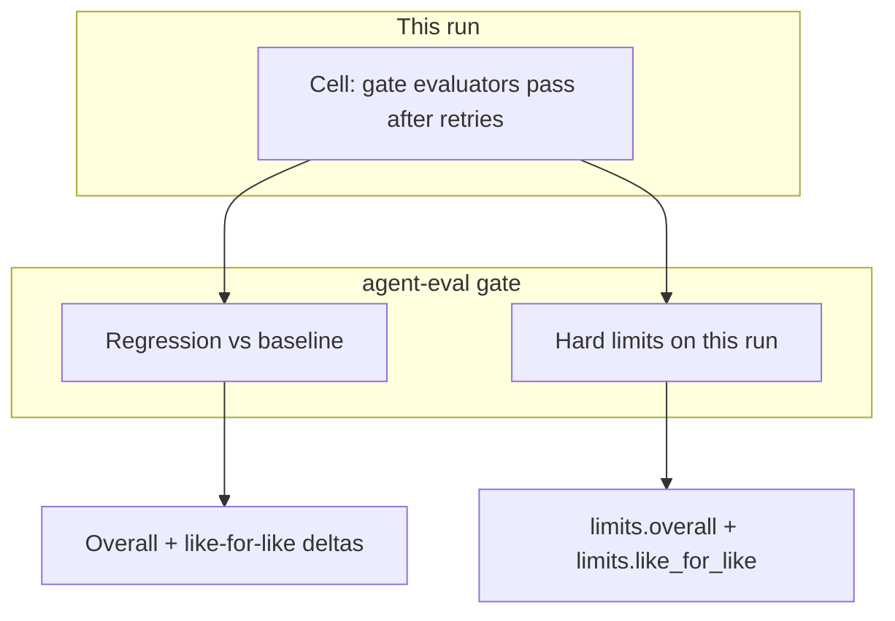
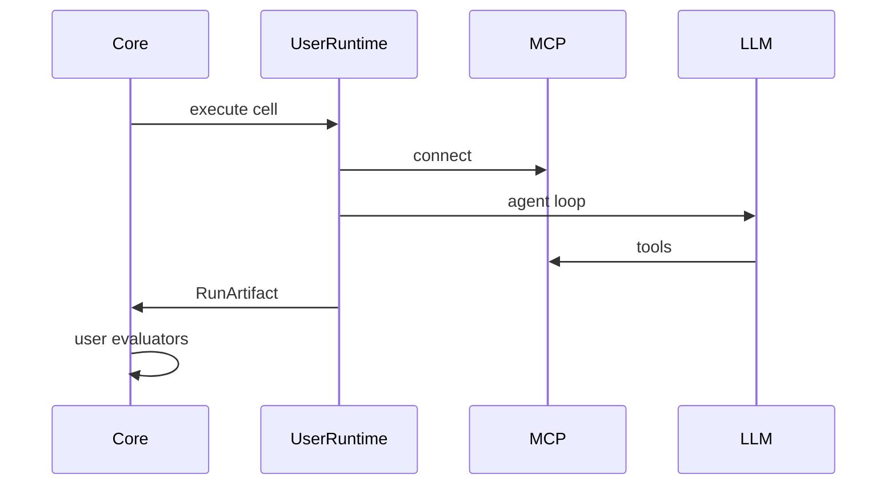

# Architecture vision — universal eval matrix

**Status:** agreed direction (2026-05-24)
**Goal:** A **pytest-like** eval framework: users own cases, runtimes, and evaluators; the library owns the **matrix**, **runs**, **reports**, and **regression gates**.

**Ship as:** `pip install` core package. This repo keeps **`examples/`** (minimal smoke) and in-repo **`evals/`** dogfood; legacy `experiments/` removed.

---

## What changes from today

| Today (coupled) | Target (pluggable) |
| --------------- | ------------------ |
| `EditCase` + file sandbox + pydantic-ai | User `@case` + `RuntimeAdapter` (optional `contrib` defaults) |
| `FileContentMatch` in core | User `@evaluator`; optional `contrib.llm_judge` |
| `reports/` at repo root | Everything under **`.agent-eval-matrix/`** |
| No baseline gate | `baseline update` + `gate` vs last accepted run |

---

## Product decisions (summary)

| Topic | Decision |
| ----- | -------- |
| MCP | **LLM-mediated only** (no direct MCP invoke tests). stdio + remote; user sets up environment/side effects |
| Runtime | **pydantic-ai optional** (`agent-eval[pydantic-ai]`). Users plug existing flows via `RuntimeAdapter` |
| Cases | **Python-first**; matrix YAML selects case ids and profiles only |
| Evaluators | User-owned; **`contrib`** may ship defaults (incl. LLM-judge). Tags: **`gate`** (must pass cell) vs **`metric`** |
| Secrets | **Values only in process env.** YAML lists `api_key_env` / `env_pass_through` **names**, never values |
| Data dir | **`.agent-eval-matrix/`** for all framework writes; override with `AGENT_EVAL_MATRIX_HOME` |
| Baseline | User runs matrix when they want; **`baseline update`** refreshes golden; **`gate`** compares to it |
| Baseline in CI | **`--baseline-from-artifact`** or committed `baselines/last.json` |
| Regression | **Two comparisons vs baseline:** overall + **like-for-like** (intersection only) |
| Hard limits | **`gate.limits`** on **this run only** (floors/ceilings); combinable with regression — catches PR vs main env drift when baseline is stale or noisy |
| Flakes | **Option A only:** cell retries (`run.max_retries`); pass cell if any attempt passes all `gate` evaluators |
| pydantic-evals | **Not in core** — optional legacy bridge only; see [pydantic-evals](#pydantic-evals-not-core) |
| History | Git + CI artifacts only — no hosted service |
| CI | **First-class** — GitHub Actions (or any CI) can `run`, `gate`, and `baseline update`; cadence is **user-defined**, not framework-scheduled |
| Sampling | **Random subset** of matrix cells per run — cap by **`max_cells`** and/or **`share`**; optional `always_include_tags`; seeded for reproducibility — see [Randomized sampling](#randomized-sampling) |

---

## Three levels of “pass”



### 1. Cell pass (this run)

For each cell, all **`gate`** evaluators must pass on **at least one** attempt (`run.max_retries` + 1 total attempts).
Evaluators tagged **`metric`** are recorded only (dashboards, debugging).

### 2. Matrix pass (`agent-eval gate`)

`gate` can enable **regression**, **hard limits**, or **both**. All enabled checks must pass.

#### Regression (vs baseline)

Compare current report to `.agent-eval-matrix/baselines/last.json` (or `--baseline-from-artifact`):

| Comparison | What it measures | When case set changes |
| ---------- | ---------------- | --------------------- |
| **Overall** | Aggregates on **all cells in this run** vs baseline’s overall section | Fingerprint mismatch → **warn**; no fail for new cells alone |
| **Like-for-like** | Aggregates on **intersection** `(case_id, profile_id)` in baseline and current run | Per-cell regression flags; subset pass rate / tokens vs baseline deltas |

#### Hard limits (this run only)

**No baseline required.** Floors and ceilings on the **current** report — useful when:

- PR and `main` use different secrets, models, or matrix size (baseline comparison is misleading).
- You want a minimum quality bar even on a new repo with no baseline yet.
- Regression passed but absolute quality is still unacceptable.

Same split as regression: `limits.overall` on the full matrix; `limits.like_for_like` on the intersection (when comparing with a baseline) or on all cells when `regression` is disabled (limits-only mode).

```yaml
gate:
  regression:
    baseline: last
    bounds:
      overall:
        pass_rate_min_delta: -0.02
      like_for_like:
        pass_rate_min_delta: -0.01
        max_regressed_cells: 0
  limits:
    overall:
      pass_rate_min: 0.80
      tokens_spent_mean_max: 15000
    like_for_like:
      pass_rate_min: 0.85
      max_regressed_cells: 0
```

`regression` only, `limits` only, or both — matrix author’s choice. Typical **PR CI:** both (regression vs `main` baseline + hard floors so env drift cannot slip under a weak delta).

---

## `.agent-eval-matrix/` layout

```text
.agent-eval-matrix/
  baselines/last.json      # golden snapshot (commit for teams, or from CI artifact)
  reports/<run>_matrix.json
  traces/                  # optional --trace
```

| Path | Git |
| ---- | --- |
| `baselines/` | Commit (recommended) or supply via `--baseline-from-artifact` |
| `reports/`, `traces/` | Ignore |

**CLI**

```bash
agent-eval run --matrix path/to/matrix.yaml
agent-eval gate                                    # latest report vs baselines/last.json
agent-eval gate --baseline-from-artifact ./artifact
agent-eval baseline update --from-report path/to/report.json
```

**CI artifact** should include `baselines/last.json` and/or `reports/` under the same `.agent-eval-matrix/` prefix.

---

## User plugins (one pattern everywhere)

| Piece | User | Framework |
| ----- | ---- | --------- |
| Cases | `@case`, fixtures | Discovery, matrix expansion |
| Runtime | `RuntimeAdapter` or custom loop | `CellExecutor`, timeouts, traces |
| Evaluators | `@evaluator` | Runs after `RunArtifact`; honors `gate` / `metric` |
| Defaults | Optional import from `agent_eval.contrib` | Reference only |

```python
from agent_eval.contrib.llm_judge import LlmJudge

@evaluator(tags=["gate"])
class Quality(LlmJudge):
    rubric = "Event must be confirmed in the final message."
```

---

## Configuration

### Secrets (simplest rule)

- **Values:** `os.environ` / CI secrets only.
- **YAML:** `api_key_env: OPENAI_API_KEY`, `env_pass_through: [DATABASE_URL]` — names only.
- **Cases:** fixtures in workspace; read env in Python if needed.
- **Reports/baselines:** redact secret-like keys; never store values.

### Matrix YAML (conceptual)

```yaml
cases:
  - my_pkg.cases.test_foo:scenario_a
profiles: [mcp-v1, mcp-v2]
models: [gpt-4o-mini]
gate:
  regression: { baseline: last, bounds: { ... } }
  limits: { overall: { pass_rate_min: 0.8 }, ... }
run:
  max_retries: 1
  sample:
    max_cells: 40
    share: 0.25
    seed: 42
    always_include_tags: [smoke]
```

Rename `tool_sets` → **`profiles`** over time (`tool_sets` deprecated one release).

### Randomized sampling

Large matrices are expensive (LLM + MCP). A run may execute a **random subset** of the full grid instead of every cell.

**Config** (`run.sample` in matrix YAML, overridable via CLI):

| Field | Meaning |
| ----- | ------- |
| `max_cells` | Upper bound on cells executed this run |
| `share` | Fraction of expanded grid in `(0, 1]` (e.g. `0.25` → 25%) |
| `seed` | RNG seed for reproducible selection (default: hash of matrix + commit or explicit int) |
| `always_include_tags` | Cells with any listed case tag **always** run; remaining budget filled by random draw |

**How many cells run:**

1. Expand full grid: `cases × profiles × models`.
2. Take all cells matching `always_include_tags` (deduped).
3. From the rest, draw uniformly at random until budget exhausted.
4. Budget = **`min(max_cells, ceil(share × total))`** when both set; use whichever field is set if only one is set; omit `sample` to run **all** cells.

```yaml
# PR matrix: cheap smoke + random coverage
run:
  sample:
    max_cells: 30
    share: 0.2
    seed: 0
    always_include_tags: [smoke]
```

```bash
agent-eval run --matrix matrices/pr.yaml --sample-max-cells 20 --sample-share 0.15 --sample-seed "$GITHUB_SHA"
```

**Report / baseline metadata** (required for honest `gate`):

- `sampling.enabled`, `sample_seed`, `cells_total`, `cells_executed`, `cells_skipped`, list of executed cell keys.
- Aggregates (**overall**) computed only over **executed** cells.
- **Like-for-like** intersection: cell keys present in **both** baseline and current run (and executed in current run). Baseline from a **full** nightly run + PR **sample** still works: LFL compares the PR sample against the same keys in baseline.

**Gate notes:**

- Regression / limits apply to aggregates on executed cells (overall) and LFL subset as today.
- Optional `gate.min_like_for_like_cells` — warn or fail if intersection is too small to trust (e.g. sample too thin).
- Do not treat skipped cells as passes or failures.

**Typical cadence:**

| Job | Sampling |
| --- | -------- |
| PR | `max_cells` + `share` + `always_include_tags: [smoke]` |
| `main` / nightly | no `sample` (full matrix) → `baseline update` |
| Local dev | no sample, or small `max_cells` |

---

## Multi-matrix repos and single-profile CI

**Expectation:** one user repo will define **several matrices** (`smoke`, `pr`, `nightly`, …). Each matrix is a **named run contract**: cases, profiles, models, sampling, gate.

**CI + baseline default (agreed):** a **gating** lane tests **one profile** (one MCP build / tool surface / prompt pack). Its baseline is the last accepted run of **that same profile** — not a fleet file with many profiles inside.

You only need **multiple profiles in one baseline** if you deliberately run a **comparison matrix** (benchmark all stacks on `main`) and choose to store that in one artifact. That is **optional**, not required for PR gates.

### Several matrices per repo (normal)

| Matrix file | Typical use | Profiles | Sampling |
| ----------- | ------------- | -------- | -------- |
| `matrices/smoke.yaml` | Fast sanity | 1 reference | none |
| `matrices/pr.yaml` | Pull request | **1 candidate** (or CLI slice) | `max_cells` + `share` |
| `matrices/nightly.yaml` | Refresh baseline for **one** production profile | **1** (same as PR) | none |
| `matrices/benchmark.yaml` | Optional: compare many profiles (research) | many | none — **no `baseline update`** or separate baseline |
| `matrices/hypothesis.yaml` | Research | subset | optional |

Reports and baselines should record **`matrix_id`** (file stem or explicit `name:`) so artifacts do not overwrite each other:

```text
.agent-eval-matrix/
  baselines/
    mcp-candidate.json     # one profile — updated only by jobs that run that profile
  reports/
    pr_<run>.json
    nightly_<run>.json
```

**One baseline file per gating lane** (usually named by **profile id** or **matrix id**). File contains aggregates + cell keys for **that profile only** — no `by_profile` map required.

`gate` loads the baseline named in matrix YAML (`gate.baseline: mcp-candidate` → `baselines/mcp-candidate.json`). PR and `main` use the **same** matrix profile list (one entry) so overall and like-for-like comparisons are apples-to-apples.

```yaml
# matrices/mcp-gate.yaml — used on PR and on main nightly
name: mcp-gate
profiles: [mcp-candidate]
models: [gpt-4o-mini]
cases: [...]
run:
  sample: { max_cells: 30, share: 0.2, always_include_tags: [smoke] }   # PR may pass; main omits sample
gate:
  baseline: mcp-candidate
  regression:
    bounds:
      overall: { pass_rate_min_delta: -0.02 }
      like_for_like: { pass_rate_min_delta: -0.01 }
  limits:
    overall: { pass_rate_min: 0.85 }
```

- **PR:** `run` (with sample) → `gate` — no `baseline update`.
- **main:** `run` (full grid, no sample) → `gate` → `baseline update` → writes `baselines/mcp-candidate.json`.

### When we previously said “nested” / multi-profile baseline

That applied only if **nightly runs many profiles in one job** and you want **one uploaded artifact** for the whole fleet. That is the **benchmark** persona (compare stacks), not the **gate** persona (protect one stack over time).

| Persona | Profiles per run | Baseline |
| ------- | ---------------- | -------- |
| **Gate (default)** | 1 | 1 file, that profile only |
| **Benchmark (optional)** | many | Report only, or `benchmark.json` not used for PR `gate` |

If you only ship gate workflows, **ignore multi-profile baselines**.

### Baseline file shape (single-profile — default)

One JSON file per gating lane. All cell keys in the file share the same `profile_id` (only one profile was run when the baseline was captured).

```json
{
  "profile_id": "mcp-candidate",
  "matrix_id": "mcp-gate",
  "fingerprint": "cases:42 models:1",
  "overall": { "pass_rate": 0.91, "tokens_spent_mean": 8200 },
  "cells": {
    "calendar/create|mcp-candidate|gpt-4o-mini": { "passed": true, "tokens_spent": 1200 }
  }
}
```

PR `gate` and `main` `gate` both compare to this file — **overall** and **like-for-like** are meaningful because profile set matches.

**Optional — multi-profile in one file (“sectioned” / formerly “nested”):** only for `matrices/benchmark.yaml` jobs that run `profiles: [a, b, c, …]` and want one artifact. Not used for standard PR CI. PR must not point `gate.baseline` at a fleet file unless it also sets `scope: like_for_like_only` + `profile:` (legacy/complex path — avoid for gate lanes).

### Options (matrices + baselines)

| Option | Idea | Pros | Cons |
| ------ | ---- | ---- | ---- |
| **A. Separate matrix per job** | `pr-mcp.yaml` lists one `profiles:` entry | Obvious in CI | Duplicate `cases:` unless shared |
| **B. Matrix `extends`** | `pr.yaml` → `extends: nightly.yaml` + override `profiles`, `run.sample` | DRY | Schema + mental overhead |
| **C. Shared `case_sets` + thin matrices** | Cases in `case_sets/`; matrices differ by profiles/models | Matches today | Several matrix files |
| **D. CLI profile slice** | `run --matrix nightly.yaml --only-profiles mcp-candidate` | One canonical grid | Easy to forget flag in CI |
| **E. Baseline per profile file** | `baselines/profiles/mcp-v2.json` | Trivial `gate` | N files; nightly fans out |
| **F. Sectioned baseline** | One file, `by_profile` map | Benchmark-only | Do not use for single-profile CI |

**Suggested default:** **C** (thin matrices) + **one baseline file per profile/lane** (same shape as single-profile JSON above). **D** optional for local dev.

### Baseline update policy (decided)

**Only full / nightly matrix jobs** may run `agent-eval baseline update` (no sampling, full `profiles` list intended for baseline).

| Job | `baseline update`? |
| --- | ------------------ |
| PR / smoke / sampled run | **No** — gate only |
| `main` nightly / `workflow_dispatch` full matrix | **Yes** |

Rationale: a PR run is a **partial** grid (one profile, maybe sample). Writing that to `baselines/nightly.json` would **overwrite fleet truth** with a subset.

### How CI chooses profile + matrix (detail)

Four layers — pick one or combine; from most explicit to most magic:

#### 1. Explicit matrix file (recommended default)

CI always knows the command:

```yaml
- run: agent-eval run --matrix matrices/pr-mcp-candidate.yaml
```

That file hard-codes `profiles: [mcp-candidate]`, `run.sample`, `gate.regression.scope: like_for_like_only`, `gate.baseline: nightly`.

| Pros | Cons |
| ---- | ---- |
| Reproducible locally (`agent-eval run --matrix …` = CI) | One file per PR “lane” if many candidates |
| Reviewable in PR (matrix change visible) | |

#### 2. Path filters (when to run which matrix)

```yaml
on:
  pull_request:
    paths:
      - 'packages/mcp-server/**'
      - 'matrices/pr-mcp.yaml'
```

| Pros | Cons |
| ---- | ---- |
| Saves CI when unrelated dirs change | Does not pick profile — only skips job |
| Maps team boundaries | Maintenance when repo layout moves |

Use **with (1)**, not instead of it.

#### 3. CLI slice (same matrix, different profile)

```yaml
- run: agent-eval run --matrix matrices/nightly.yaml --only-profiles mcp-candidate --sample-max-cells 30
```

Report records `profile_filter: [mcp-candidate]`, `matrix_id: nightly`.

| Pros | Cons |
| ---- | ---- |
| Single source of truth for cases × models | CI flag must match intent; drift if someone edits nightly profiles list |
| Good for local “run my stack against full case pack” | `gate` must know baseline subsection = that profile |

Use for **power users**; PR can still use (1) for clarity.

#### 4. Dynamic profile from CI env (optional later)

```yaml
env:
  PROFILE: ${{ steps.detect.outputs.profile }}
steps:
  - id: detect
    run: echo "profile=mcp-candidate" >> $GITHUB_OUTPUT  # from label, path heuristic, or human input
  - run: agent-eval run --matrix matrices/pr.yaml --only-profiles "$PROFILE"
```

| Pros | Cons |
| ---- | ---- |
| One `pr.yaml` for all MCP PRs | Heuristic wrong → wrong stack tested |
| | Harder to reproduce without env |

**Recommendation:** **(1) + (2)** for PR; **(3)** documented for dev; **(4)** only if you outgrow file-per-lane.

### `gate` behavior (single-profile baseline)

1. Load `baselines/<gate.baseline>.json` — expect `profile_id` to match the run (or exactly one profile in report).
2. Compare **overall** and **like-for-like** vs that file (same profile → overall compare is valid).
3. Apply **limits** on executed cells.
4. If report has **extra** profiles vs baseline file → **error** (misconfigured CI). If baseline was built from a multi-profile benchmark file by mistake → same error with hint.

### CI workflow patterns

```yaml
# PR — gate only, no baseline update
jobs:
  pr-eval:
    steps:
      - uses: actions/download-artifact@v4   # optional: nightly baseline from main
        with: { name: agent-eval-baseline-nightly }
      - run: agent-eval run --matrix matrices/pr-mcp.yaml
      - run: agent-eval gate --baseline .agent-eval-matrix/baselines/mcp-candidate.json

# main — same matrix, no sample, refresh baseline
jobs:
  nightly:
    steps:
      - run: agent-eval run --matrix matrices/mcp-gate.yaml   # same file; sample disabled on main via matrix env or separate matrices/mcp-gate-full.yaml
      - run: agent-eval gate --baseline .agent-eval-matrix/baselines/mcp-candidate.json
      - run: agent-eval baseline update --from-report .agent-eval-matrix/reports/latest.json
      - uses: actions/upload-artifact@v4
        with: { name: agent-eval-baseline-mcp-candidate, path: .agent-eval-matrix/baselines/mcp-candidate.json }
```

### Open choices (remaining)

1. **One matrix file for PR + main** (sample toggled via CLI/`run.sample` only on PR) vs **two files** (`mcp-gate-pr.yaml` with sample, `mcp-gate-full.yaml` without)?
2. **Benchmark matrix** with many profiles — ship in core docs as optional, or examples only?

---

## MCP evaluation

User case starts MCP (stdio or remote), runs their agent loop with MCP tools, returns **`RunArtifact`**.
Framework does not own docker, DBs, or production side effects.



---

## CI and baselines (GitHub Actions)

The framework does **not** run on a schedule by itself. **CI is fully supported** — you wire workflows to whatever cadence you want.

| Workflow pattern | Typical trigger | Commands |
| ---------------- | ----------------- | -------- |
| **PR gate** | `pull_request` | `run` with **`run.sample`** → `gate` (baseline from full `main` run) |
| **Main refresh** | `push` to `main` | full matrix (no sample) → `gate` → `baseline update` → commit or upload artifact |
| **Nightly / manual** | `schedule`, `workflow_dispatch` | full matrix, optional `baseline update` on label |
| **Baseline-only** | `workflow_dispatch` | `baseline update` after human-approved run |

Example (conceptual):

```yaml
# PR: regression vs main baseline + hard limits on this run
- run: agent-eval run --matrix matrices/ci.yaml
- run: agent-eval gate --baseline-from-artifact "$BASELINE_DIR"
  # matrix defines gate.regression + gate.limits

# Main: update golden when team accepts (auto or manual job)
- run: agent-eval run --matrix matrices/full.yaml
- run: agent-eval gate || exit 1
- run: agent-eval baseline update --from-report .agent-eval-matrix/reports/latest.json
- uses: stefanzweifel/git-auto-commit-action@v5  # optional: commit .agent-eval-matrix/baselines/
```

**Clarification:** “User chooses whether to run in CI” means the product does not mandate a hosted runner — **not** that CI is unsupported. If you omit a PR workflow, you get no PR protection; that is a **configuration gap**, not a platform limit.

### Tradeoffs (baseline + CI)

| Risk | Mitigation |
| ---- | ---------- |
| CI not wired | Add PR `run` + `gate` workflow; document copy-paste Action |
| Stale committed baseline | `baseline update` on `main` job or manual dispatch |
| Baseline updated too eagerly in CI | Gate before update; require `workflow_dispatch` or label for auto-commit |
| Case set changed | Fingerprint warning; **like-for-like** for regression; refresh baseline when intentional |
| PR vs main env drift | Pin models/secrets where possible; **`gate.limits`** on PR so quality has floors even if baseline is from a different env; regression optional or from `main` artifact |
| Auto-commit noise | Upload artifact only; commit `baselines/` weekly by hand |

---

## Flake handling (v1) — option A

**Decision:** **Cell retries only** for v1.

| Config | Behavior |
| ------ | -------- |
| `run.max_retries` | Default `0` locally; CI often `1`–`2` |
| Pass rule | Cell **passes** if **any** attempt passes all `gate` evaluators |
| Reporting | `attempts`, `flaky_suspect: true` when attempts disagree |

**Cost:** up to `(1 + max_retries)×` LLM calls per failing cell. Keep `max_retries` low (1–2).

**Deferred (not v1):** gate-time re-runs (B), `flake` tags (C), rolling history (F), quarantine file (G).

---

## pydantic-evals (not core)

Used today for three things we split:

| Today | Target |
| ----- | ------ |
| `Dataset.evaluate` loop | Core `CellExecutor` |
| `Evaluator` classes | Core `@evaluator` |
| `increment_eval_metric` in tools | `RunContext` metrics API |

Core drops `pydantic-evals` dependency; optional **`agent-eval[legacy]`** bridge for old evaluator classes during migration.

---

## Core protocols (sketch)

```python
class RunArtifact: ...   # messages, tool trace, metrics, files
class RuntimeAdapter:
    async def execute(self, ctx: RunContext) -> RunArtifact: ...
class Evaluator:
    async def evaluate(self, ctx, artifact) -> EvalOutcome: ...
```

**Matrix cell** = `(case_id, profile_id)` → `CellResult`.
**Report** = all cells + overall aggregates + intersection keys for like-for-like.

---

## Phased roadmap

| Phase | Deliverable |
| ----- | ----------- |
| 0 | Schemas: `RunArtifact`, `CellResult`, baseline JSON, gate bounds, sampling metadata, flake fields (`retries`, `flaky_suspect`) |
| 1 | PyPI core without pydantic-ai / pydantic-evals |
| 2 | `CellExecutor`, Python case collection, port file-edit example |
| 3 | Evaluator tags; `contrib.llm_judge` |
| 4 | MCP helper extra; example matrix |
| 5 | `.agent-eval-matrix/`, `gate`, retries, `--baseline-from-artifact`, example GH workflows (`pr-gate`, `main-baseline-update`) |
| 6 | HTML / PR comment report |

---

## Non-goals

- Direct MCP tests without LLM
- Hosted regression SaaS
- Owning user test environments
- Deterministic LLM reproduction

---

## See also

- [README-pitch-draft.md](./README-pitch-draft.md) — Gategrid product pitch (target README)
- [competitive-landscape.md](./competitive-landscape.md) — market map + product naming
- [battlecard.md](./battlecard.md) — vs promptfoo / DeepEval
- [v1-implementation-checklist.md](./v1-implementation-checklist.md) — phased build checklist
- [dogfood-notes.md](./dogfood-notes.md) — spike diary (fast-mcp-telegram, ai-antispam, opencrabs)
- [adoption-usability-backlog.md](./adoption-usability-backlog.md) — CLI, CI Action, HTML reports
- **ADR** (Architecture Decision Record): short frozen note per decision (`docs/adr/0001-….md`) when implementing Phase 0
