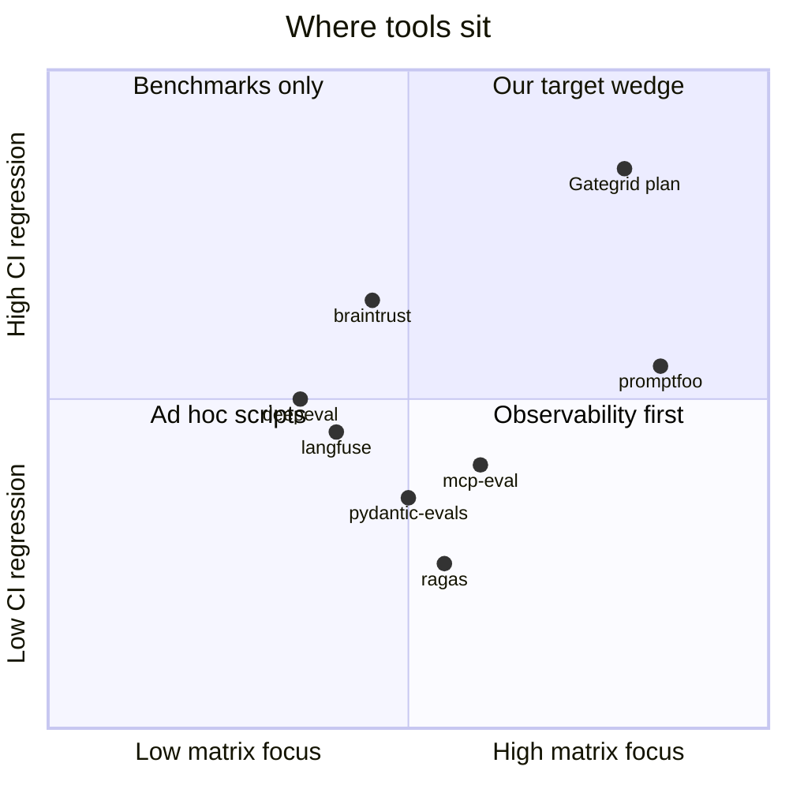

# Competitive landscape

**Status:** 2026-05-24 · aligns with [architecture-vision.md](architecture-vision.md) and [README-pitch-draft.md](README-pitch-draft.md).

**Positioning (one line):** Self-hosted matrix runner that turns *your* agent/MCP test suite into a **codecov-style CI gate** for **one production profile** at a time — not another prompt benchmarker or observability SaaS.

**Related:** [battlecard.md](battlecard.md) (promptfoo vs DeepEval vs us) · [v1-implementation-checklist.md](v1-implementation-checklist.md) · [Product naming](#product-naming-revisited)

---

## Executive summary

| Finding | Implication |
| ------- | ----------- |
| **promptfoo** (~21k ⭐) owns prompt/matrix mindshare + MCP red team | Compete on **git baselines**, **single-profile gate**, **Python runtime plugins** — not OWASP breadth |
| **DeepEval** (~16k ⭐) owns “pytest for LLMs” + metrics | Compete on **matrix orchestration** + **repo-local golden files** without Confident AI |
| **Langfuse / LangSmith / Braintrust** own trace → eval loops in cloud | Optional complement; win teams wanting **no SaaS for gating** |
| **pydantic-evals** overlaps our current stack | De-couple; we are **runner + gate**, they are **eval library** |
| **mcp-eval** (~23 ⭐) matches MCP E2E story but tiny | Ship one **MCP gate** example; we are infra, not OTEL-first |
| **evalgate** on PyPI already = “LLM evals as PR check” | **Avoid** that name; see [naming](#product-naming-revisited) |

No incumbent ships all three: **pytest-shaped plugins** + **cases × profiles × models matrix** + **committed baseline JSON with overall + like-for-like gate**.

---

## Popularity (GitHub stars, May 2026)

Rough tiers — stars are a proxy, not revenue or installs.

| Tier | Project | Stars | Primary focus |
| ---- | ------- | ----: | ------------- |
| Observability + eval | [langfuse](https://github.com/langfuse/langfuse) | ~28k | Traces, datasets, experiments (TS) |
| Prompt / matrix eval | [promptfoo](https://github.com/promptfoo/promptfoo) | ~21.5k | YAML matrix, red team, CI (TS) |
| Agent framework | [pydantic-ai](https://github.com/pydantic/pydantic-ai) | ~17k | Runtime; evals via pydantic-evals |
| Pytest-like metrics | [deepeval](https://github.com/confident-ai/deepeval) | ~15.7k | Metrics + pytest (Python) |
| RAG metrics | [ragas](https://github.com/vibrantlabsai/ragas) | ~14k | RAG quality + synthesis |
| Tracing + eval | [phoenix](https://github.com/Arize-ai/phoenix) | ~10k | OTEL + eval (Python) |
| Research benchmarks | [inspect_ai](https://github.com/UKGovernmentBEIS/inspect_ai) | ~2.1k | Public benchmark suites |
| Scorer library | [autoevals](https://github.com/braintrustdata/autoevals) | ~0.9k | Scorers + Braintrust cloud |
| MCP E2E eval | [mcp-eval](https://github.com/lastmile-ai/mcp-eval) | ~23 | Agent↔MCP + OTEL |
| Tiny CI gates | [llm-quality-gate](https://github.com/Emart29/llm-quality-gate) | ~1 | Fixed metrics PR gate |

**LangSmith** — traction via LangChain cloud; open SDK repo is small. **Braintrust** — product is SaaS-first; `autoevals` is the OSS scorer surface.

---

## Positioning map



---

## Feature matrix vs planned product

Legend: **●** first-class · **◐** partial / DIY · **○** weak / different focus

| Capability | **Us (planned)** | **promptfoo** | **DeepEval** | **pydantic-evals** | **Langfuse / LangSmith / Braintrust** | **mcp-eval** |
| ---------- | ---------------- | --------------- | ------------ | ------------------ | ------------------------------------- | ------------ |
| Matrix (cases × variants × models) | ● | ● | ◐ | ◐ | ◐ | ◐ |
| User-owned runtime (any agent loop) | ● | ◐ | ● | ◐ | ◐ | ◐ |
| User-owned evaluators | ● | ● | ● | ● | ● | ● |
| CI exit / gate command | ● `gate` | ● | ● `test run` | ◐ | ● | ◐ |
| Regression vs **git** baseline | ● | ◐ | ◐ (cloud UI) | ◐ | ◐ (cloud) | ◐ |
| Single-profile gate vs benchmark matrix | ● | ◐ | ◐ | ◐ | ◐ | ◐ |
| Overall + like-for-like comparison | ● | ◐ | ◐ | ○ | ◐ | ◐ |
| Hard limits + regression | ● | ◐ | ◐ | ◐ | ◐ | ◐ |
| PR sampling (`max_cells` / `share`) | ● | ◐ | ◐ | ◐ | ● (Braintrust) | ○ |
| Cell retries / flake signal | ● v1 | ◐ | ◐ | ○ | ◐ | ○ |
| MCP LLM-mediated E2E | ● | ● | ◐ | ◐ | ◐ | ● |
| Direct MCP security scan | ○ | ● | ◐ | ○ | ○ | ◐ |
| Red teaming / OWASP | ○ | ● | ● | ○ | ◐ | ◐ |
| Web UI / hosted history | ○ | ● | ● (Confident AI) | ● Logfire | ● | ● OTEL |
| Synthetic test generation | ○ | ● | ● | ◐ | ● | ● |
| No hosted service required | ● | ● | ● | ● | ◐ | ● |

---

## Competitor notes

### promptfoo — mindshare leader

- **Wins:** Declarative matrix, many providers, MCP on providers + dedicated `mcp` red-team target, GitHub Action, `promptfoo view`, OpenAI acquisition (2026) increases security narrative.
- **Loses to us when:** Team needs **Python-first** cases, **custom agent loop** (not provider-centric), **one baseline file per profile** in git, **gate vs benchmark** as first-class workflows.
- **Docs:** [CI/CD](https://www.promptfoo.dev/docs/integrations/ci-cd/) · [MCP](https://www.promptfoo.dev/docs/integrations/mcp/)

### DeepEval — pytest narrative

- **Wins:** Built-in metrics (G-Eval, RAG, etc.), `deepeval test run`, pytest integration, ~16k stars.
- **Loses to us when:** Team wants **matrix expansion**, **profile-scoped baselines**, and **gate semantics** without pushing history to [Confident AI](https://www.confident-ai.com/).
- **Docs:** [Comparisons](https://deepeval.com/docs/introduction-comparisons) · [Flags](https://deepeval.com/docs/evaluation-flags-and-configs)

### pydantic-evals — ecosystem neighbor

- **Wins:** Typed datasets, report evaluators, span-based agent checks, Logfire.
- **Loses to us when:** Product need is **CI gate CLI** + **`.gategrid/baselines/`** (or similar), not experiment browser.
- **Docs:** [Core concepts](https://pydantic.dev/docs/ai/evals/getting-started/core-concepts/)

### Langfuse / LangSmith / Braintrust — platform path

- **Wins:** Trace → dataset → experiment → production loop; PR comments; regression vs `main` experiment (LangSmith pattern).
- **Loses to us when:** Buyer requires **air-gapped / git-only** golden runs, **no eval SaaS**, or **embeddable runner** in their monorepo.
- **Docs:** [Braintrust evaluate](https://www.braintrust.dev/docs/evaluate) · [LangSmith CI example](https://docs.langchain.com/langsmith/cicd-pipeline-example)

### mcp-eval — scenario overlap, tiny footprint

- **Wins:** Real agent↔MCP, OTEL-native assertions, pytest.
- **Loses to us when:** Need **matrix + baseline update + gate** across profiles/models, runtime-agnostic.
- **Site:** [mcp-eval.ai](https://mcp-eval.ai/overview)

### Ragas / Inspect AI — adjacent, not direct

- **Ragas:** RAG optimization and metrics; weak agent CI gate story.
- **Inspect AI:** Public benchmarks and safety evals; not product CI on private cases.

### Niche regression gates

- **[FairEval-Suite](https://github.com/kritibehl/FairEval-Suite):** baseline vs candidate + stats; no matrix/MCP product.
- **[evalgate](https://pypi.org/project/evalgate/)** (PyPI): “Deterministic LLM/RAG evals as a PR check” — **name collision risk** for us if we pick `evalgate`.

---

## Strategic wedge

| We lead | We defer |
| ------- | -------- |
| Git-native golden baseline per **gate profile** | Red team / OWASP catalogs |
| `run` → `gate` → `baseline update` workflow | Hosted dashboards |
| Gate vs benchmark matrix personas | Synthetic dataset factories |
| Pluggable `RuntimeAdapter` + `@case` / `@evaluator` | Direct MCP protocol testing |
| Like-for-like + overall + hard limits | Deterministic LLM reproduction |

**Primary win targets:** promptfoo users who need Python agent loops + git baselines; DeepEval users who outgrow pytest files without matrix/gate; MCP authors evaluating LLM-mediated E2E.

**Usually lose to:** Teams standardized on Langfuse/LangSmith/Braintrust; security buyers wanting promptfoo red team only.

---

## Product naming (revisited)

Naming should reflect **CI regression gate** first, **matrix runner** second — not “another eval matrix” (promptfoo, evalgrid, evalgate).

### Names to avoid

| Name | Why |
| ---- | --- |
| **agent-eval-matrix** | Former GitHub slug; renamed to **gategrid** |
| **evalgate** | **Taken on PyPI** — “Deterministic LLM/RAG evals as a PR check” (direct niche overlap) |
| **agentgate** | **Taken** — multi-agent framework |
| **evalgrid / agentgrid** | **Taken** on PyPI |
| **matrixgate** | Confusable with [MatrixGateway](https://github.com/leoleegit/MatrixGateway) repos |
| **regate** | Confusable with genomics [ReGaTE](https://github.com/C3BI-pasteur-fr/ReGaTE) |

### PyPI-available candidates (404 on pypi.org, May 2026)

| Rank | Name | Pros | Cons |
| ---- | ---- | ---- | ---- |
| **1** | **gategrid** | Short; **gate + grid**; CLI `gategrid`; dir `.gategrid/`; distinct from evalgate | Slight echo of “eval grid” category |
| **2** | **baselinegrid** | Strong **codecov / golden** story | Longer; less “matrix” in the word |
| **3** | **reggate** | **Regression gate** is obvious | Weak matrix signal; sounds security-adjacent |
| **4** | **goldengrid** | “Golden” baseline metaphor | Less obvious for new users |
| **5** | **gridbaseline** | Baseline explicit | Awkward compound; CLI clumsy |

Also free: `reggate`, `stackreg`, `profilegrid`, `gatecell`, `cellreg`, `prgate` — narrower stories.

### Recommendation

| Field | Value |
| ----- | ----- |
| **Product name** | **Gategrid** |
| **PyPI package** | `gategrid` |
| **CLI** | `gategrid run`, `gategrid gate`, `gategrid baseline update` |
| **Import** | `import gategrid` · decorators `gategrid.case`, `gategrid.evaluator` |
| **Data dir** | `.gategrid/` (`baselines/`, `reports/`, `traces/`) |
| **Env override** | `GATEGRID_HOME` |
| **Tagline** | Matrix evals for agents — **pytest for your cases, codecov for your regressions** |
| **GitHub repo** | `leshchenko1979/gategrid` (redirects from `agent-eval-matrix`) |

**Alternates if Gategrid feels too abstract:** **baselinegrid** (enterprise/QA tone) or **reggate** (CI-only tone).

### Positioning ↔ name fit

```text
pytest for cases     →  gategrid.case, plugins
codecov for regressions →  gategrid gate, baselines/<profile>.json
matrix runner        →  "grid" in Gategrid
MCP / agents         →  messaging, not acronym (avoid "AEM")
```

---

## See also

- [battlecard.md](battlecard.md) — sales/engineering one-pager vs promptfoo and DeepEval
- [v1-implementation-checklist.md](v1-implementation-checklist.md) — build order to reach competitive parity on the wedge
- [architecture-vision.md](architecture-vision.md) — full design
- [README-pitch-draft.md](README-pitch-draft.md) — user-facing pitch (Gategrid branding)
